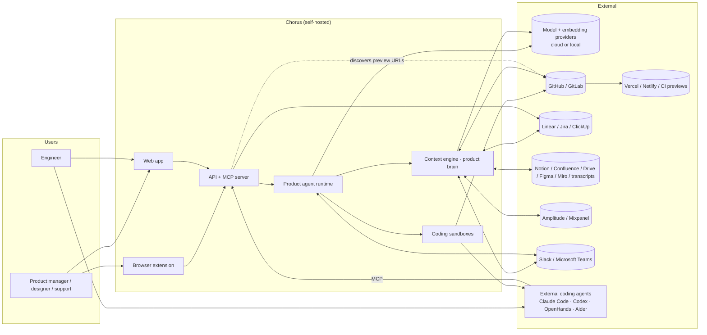
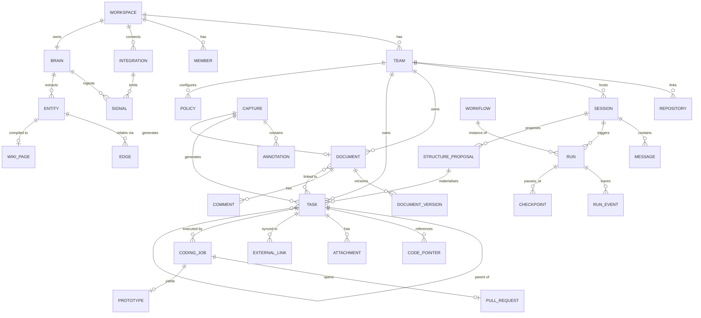
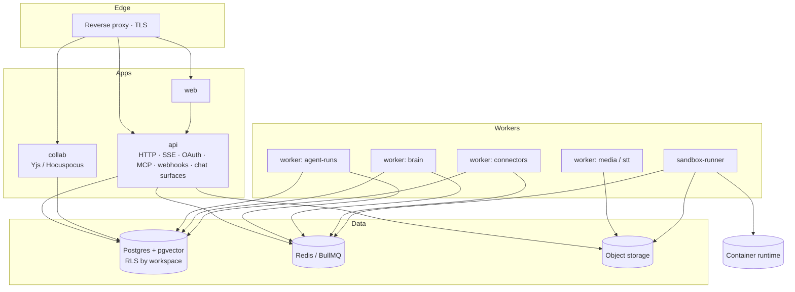
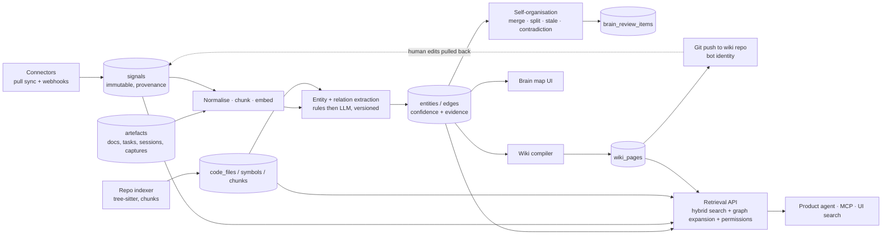
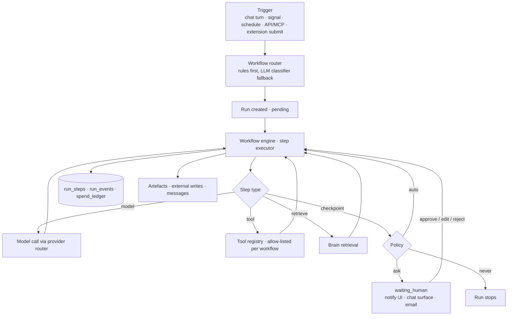
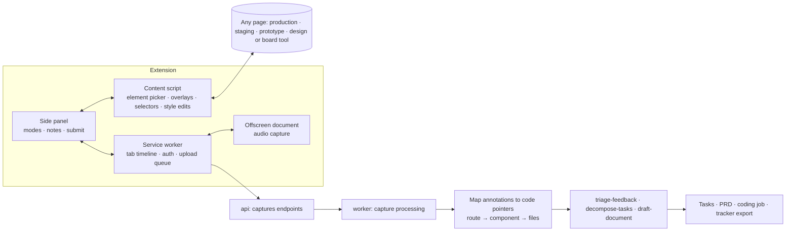
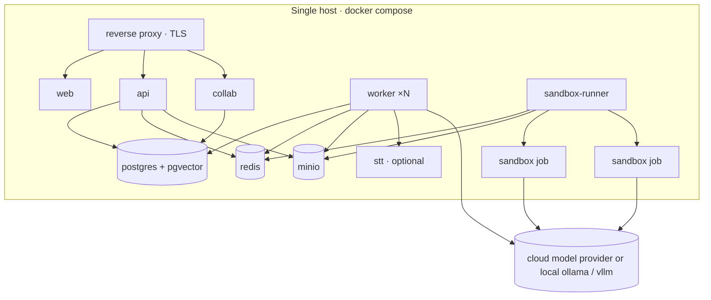

# Chorus — Architecture

**Status:** Baseline architecture, v1.0
**Applies to:** the whole platform, all phases
**Audience:** contributors implementing any part of Chorus, and reviewers assessing whether a change fits

---

## 1. Purpose and scope

Chorus is a self-hostable, open-source **product workspace for teams that build with coding agents**. It captures product intent once, enriches it automatically with the team's own context, shapes it collaboratively into unambiguous work, and hands that work to humans or to coding agents — without losing the *why* between steps.

This document is the authoritative description of **how Chorus is built**. It is normative: a pull request that contradicts it should either change this document first or be rejected. It covers:

- the domain model every module shares (§4)
- the technology choices and why they were made (§5)
- the runtime process model and the code that lives in each process (§6, §7)
- the data architecture, including tenancy enforcement (§8)
- each major subsystem in enough detail to implement it: model layer, context engine, agent runtime, coding sandboxes, prototypes, MCP, extension, chat surfaces, integrations (§9–§17)
- the external contracts: HTTP API, realtime, MCP, webhooks (§18, §19)
- security, observability, configuration and deployment (§20–§22)
- the **testing architecture**, which is outside-in and test-first (§23) — see also `CLAUDE.md`
- capacity targets (§24), delivery phases (§25), the full requirement catalogue with traceability (§26), and the decisions deliberately left open (§27)

**What Chorus is not:** an issue-tracker replacement, a deployment platform, a proprietary model, or a mobile product. It integrates with trackers, discovers previews created by other systems, and treats every model provider as swappable.

---

## 2. Architectural principles

These principles decide arguments. When two designs are both workable, the one that better satisfies the earlier principle wins.

1. **Intent is the primary artefact.** Chats, recordings, feedback and documents are sources of intent; tasks, specs and pull requests are derived from them and keep a traversable link back to their origin. A feature that severs that link is wrong.
2. **Context is compiled, not curated.** No human maintains a wiki by hand. Signals are ingested, entities and relationships extracted, pages generated. Humans correct; corrections are re-ingested as high-trust signals and change future output.
3. **Humans hold the gates.** Every autonomous step passes a checkpoint whose policy is `auto`, `ask` or `never`. Structure proposals, external writes, coding-job launches and spend thresholds are gated by default.
4. **Bring your own agent and model.** No capability may depend on a single vendor. Every model call goes through one provider-agnostic interface; every coding agent is an adapter; every agent-facing capability is reachable over MCP.
5. **Self-host first.** `docker compose up` yields a working system on one host. The only mandatory external dependency is the chosen model endpoint, which may be local.
6. **Everything is auditable.** Every artefact mutation, agent action, tool call and unit of spend is recorded and attributable to a user or a run, in the same transaction as the change itself.
7. **Boring where possible.** The interesting parts are the context engine and the agent runtime. Everything else uses mainstream, well-documented technology so contributors are productive on day one.
8. **Contracts before implementations.** Connectors, workflows, coding adapters and chat surfaces are plugin interfaces with typed contracts, fixture-based contract tests and semantic versioning. Core never special-cases one implementation.
9. **Outside-in and test-first.** Behaviour is specified as an executable acceptance test before the implementation exists (§23, `CLAUDE.md`). Requirement IDs appear in test names, so traceability is mechanical rather than clerical.

---

## 3. System overview



**The three loops.** Everything in Chorus belongs to one of three loops, and each loop has an owning subsystem:

| Loop | Question it answers | Owner | Requirement families |
|---|---|---|---|
| **Understand** | What is true about our product, users and code right now? | Context engine (§10) | BRAIN, INT |
| **Shape** | What exactly should we build, and why? | Agent runtime + artefacts (§11, §8) | CHAT, DOC, TASK, NAV |
| **Deliver** | Who or what does it, and how do we see the result? | Coding execution, prototypes, handoff (§12–§15) | CODE, PROTO, MCP, EXT |

Cross-cutting: WS (tenancy, identity, policy), SLACK/TEAMS (surfaces), NFR (platform qualities).

---

## 4. Domain model

### 4.1 Glossary

| Term | Definition |
|---|---|
| **Workspace** | Top-level tenant. Owns members, integrations, policies, the product brain, and one or more teams. The boundary for every table, every retrieval and every credential. |
| **Team** | A product area within a workspace, with its own charter, repositories, trackers and default policies. New workspaces get exactly one default team. |
| **Charter** | A short brief (mission, users, constraints, tone) attached to a team; always injected into agent context. |
| **Session** | A chat thread between one or more humans and the product agent. Sessions produce artefacts and carry a decision log. A session is surface-independent: the same session may be viewed on the web and continued in Slack or Teams. |
| **Artefact** | Any durable output: Document, Task, Capture, Prototype, Run or Wiki page. All artefacts share identity, ownership, linking and versioning behaviour. |
| **Document** | Long-form artefact with a type (`prd`, `spec`, `strategy`, `freeform`, `gap_spec`) and a collaborative rich-text body stored as a CRDT. |
| **Task** | Unit of work: title, description, acceptance criteria, tags, code pointers, links, assignee, external tracker mapping, status. Tasks form a tree (epic → task → subtask). |
| **Structure proposal** | An agent-proposed task tree held in `proposed` state until a human confirms it. Nothing is written to `tasks` before confirmation. |
| **Capture** | A recording produced by the browser extension: element annotations, DOM snapshots, screenshots, transcript, tab timeline. |
| **Code pointer** | A reference into a repository — `repo`, `path`, optional `symbol`, `line range`, `commit` — carrying a `source` and a `confidence`. Attached to tasks and captures. |
| **Signal** | A raw inbound item from an integration (a chat message, a tracker update, an analytics anomaly, a transcript, a commit). Immutable, with provenance and permission scope. |
| **Entity** | A node in the brain graph: `feature`, `component`, `customer`, `metric`, `decision`, `person`, `repo`, `page`, `ticket`, `experiment`, `topic`. |
| **Edge** | A typed, evidence-bearing relationship between entities: `implements`, `mentions`, `depends_on`, `owned_by`, `measured_by`, `decided_in`, `duplicates`, `blocks`, `relates_to`. |
| **Wiki page** | A compiled Markdown page describing an entity or topic, regenerated from the graph and pushed to a git repository by a bot identity. |
| **Workflow** | A named, versioned agent procedure with declared inputs, outputs, tools, model tier, steps and checkpoint policy. |
| **Run** | One execution of a workflow (or an ad-hoc agent turn) with its full trace: model calls, tool calls, checkpoints, artefacts, cost. |
| **Checkpoint** | A point in a run where policy decides whether to proceed automatically, ask a human, or stop. |
| **Coding job** | A run of `implement-task` that executes a coding-agent adapter inside a sandbox and yields a pull request. |
| **Prototype** | A coding-job variant that yields a preview deployment on the real repository with the backend mocked. |
| **Connector** | An integration implementation: auth, pull/webhook sync, actions, and normalisation to signals. |
| **Chat surface** | Slack, Microsoft Teams or another conversational host implementing one interface (§16). |
| **Handoff** | Exporting a task to a person, a tracker, or an external coding agent via an MCP prompt or link. |

### 4.2 Entity relationships



### 4.3 Lifecycles

State machines live in `packages/core/src/state/` as explicit transition tables. Illegal transitions throw a `TransitionError`; the transition table is itself the unit under test.

- **Document:** `draft → in_review → approved → archived`. Approval is optional per team policy but is the precondition for approval-gated automations (DOC-10).
- **Structure proposal:** `proposed → confirmed | edited_and_confirmed | rejected`. Terminal states are immutable; a rejected proposal retains its rejection feedback for the agent.
- **Task:** `backlog → ready → in_progress → in_review → done | cancelled`, plus a per-tracker `sync_state` of `unsynced | synced | conflict`.
- **Coding job:** `queued → provisioning → running → awaiting_checkpoint → pr_opened → succeeded | failed | cancelled`.
- **Run:** `pending → running → waiting_human → completed | failed | cancelled`.
- **Capture:** `recording → uploaded → processing → ready → consumed`.

### 4.4 Identity, keys and links

- All primary keys are **ULIDs** (sortable, 26 characters, from `packages/core`). No sequential integers appear in URLs or APIs.
- Tasks additionally carry a human key `CH-<n>`, unique per **team**, generated from a per-team counter row taken with `SELECT … FOR UPDATE`. The key is stable for the task's life and is what appears in chat, PR titles and MCP prompts.
- Cross-artefact relationships are expressed once, in `artefact_links(from_type, from_id, to_type, to_id, relation)`, rather than as bespoke foreign keys per pair. Foreign keys are reserved for containment (`tasks.parent_id`, `messages.session_id`).
- Every artefact exposes a canonical web URL (`/t/{teamSlug}/task/{key}`) and a canonical MCP resource URI (`chorus://task/{id}`). Both resolve through the same permission check.

---

## 5. Technology decisions

### 5.1 Stack

| Layer | Choice | Rationale |
|---|---|---|
| Language | **TypeScript** everywhere (web, API, workers, MCP, extension, adapters) | One language spans a browser extension, an SSR web app and an MCP server; Zod schemas shared end-to-end give runtime validation and static types from one definition. Coding adapters shell out to agents written in any language, so Python agents remain first-class without a second service. |
| Monorepo | pnpm workspaces + Turborepo | Fast, incremental, conventional. The task graph gives cheap CI caching. |
| Web app | **Next.js** (App Router), React, Tailwind, shadcn/ui, TanStack Query | SSR for auth-gated pages, a mainstream component vocabulary, straightforward theming and accessibility primitives. |
| Editor | **Tiptap** (ProseMirror) + **Yjs**, synced by **Hocuspocus** | Proven multiplayer rich text with comments, suggestion marks and version snapshots. The CRDT removes server-side conflict logic. |
| API | **Hono** on Node 22, Zod-validated routes, generated OpenAPI | Small, fast, first-class streaming. tRPC was rejected: the API must serve a browser extension, MCP clients and third parties, so a described, versioned HTTP contract is required. |
| Realtime | SSE for chat/job/run streams; WebSocket (Hocuspocus) for CRDT; Postgres `LISTEN/NOTIFY` fanned out over Redis pub/sub | No extra realtime service in the reference deployment. |
| Database | **PostgreSQL 16** + **pgvector**, `tsvector`/`pg_trgm`, **row-level security** keyed by workspace | One store for relational, vector and lexical needs. Graph traversal by recursive CTE over `entities`/`edges`; a dedicated graph database is deliberately deferred (ADR-0002). |
| ORM / migrations | **Drizzle** | Typed schema in TypeScript, SQL-first migrations that can express RLS policies and index definitions without fighting the ORM. |
| Queue / scheduler | **BullMQ** on **Redis**, behind `packages/queue` | Durable jobs, retries with backoff, rate limiting, repeatable (cron) jobs. Durable *workflow* state lives in Postgres (`runs`, `run_steps`) so a worker crash never loses a run. ADR-0004 requires the step interface not to leak BullMQ types, so the package is the only place it may be imported and a consumer's `Job` carries four fields — asserted at runtime, because a type-level promise disappears at runtime. Idempotency keys are hashed on the way in: a natural key here is `${repositoryId}:${commitSha}`, the backend rejects a colon in a job id, and making callers know that is the leak the ADR forbids. |
| Object storage | **S3-compatible** (MinIO in compose) | Screenshots, audio, attachments, sandbox logs and diffs. |
| Model layer | **Vercel AI SDK** provider abstraction behind an internal router; optional **LiteLLM** proxy | Provider-agnostic streaming, tool calling and structured output across Anthropic, OpenAI, Google, Azure OpenAI, OpenRouter, Ollama and vLLM. |
| Speech-to-text | Pluggable: browser Web Speech API, self-hosted `whisper.cpp`/faster-whisper container, or a provider API | Voice capture stays self-hostable. |
| Code indexing | **tree-sitter** for symbols and imports, language-agnostic chunking, **ripgrep** for exact search, optional SCIP/LSIF import | Multi-language without running a language server per language. |
| Sandboxes | **Docker** engine API (rootless preferred), optional **gVisor** runtime, adapter-specific images | Universal for self-hosters; Kubernetes Jobs and hosted sandboxes slot behind the same interface. |
| Auth | **Better Auth** with OIDC providers, email verification and organisation/roles, plus a platform-issued **OAuth 2.1** server for MCP and the extension | Hand-rolled auth is a liability; MCP requires dynamic client registration and PKCE, which the platform OAuth server provides. |
| Extension | **WXT**, Manifest V3, side panel API, offscreen document for audio | One codebase producing Chrome, Edge and Firefox builds. |
| Slack | **Bolt for JavaScript**, HTTP mode | Standard, stateless, fits behind the same reverse proxy. |
| Teams | **Bot Framework SDK for JavaScript** + Microsoft Graph | The only supported route for Teams bots, message extensions and tabs. |
| Observability | **OpenTelemetry** SDK, Prometheus metrics, structured logs (pino) | One instrumentation vocabulary for HTTP, jobs, model calls and sandboxes. |
| Packaging | Per-service Docker images, reference `docker-compose.yml`, Helm chart | NFR-1. |

### 5.2 Decisions recorded as ADRs

Architectural decisions live in `docs/adr/NNNN-title.md` in the Nygard format. The baseline set, all *accepted*:

| ADR | Decision | Consequence |
|---|---|---|
| 0001 | TypeScript monorepo, no second backend language | Python agents integrate via sandboxed CLIs, not in-process |
| 0002 | Postgres-only persistence (relational + vector + lexical + graph-by-CTE) | Revisit at >10⁶ edges or when brain-map queries exceed their latency budget (§27) |
| 0003 | Row-level security is the primary tenancy boundary | Every query runs inside a transaction with `app.workspace_id` set; no ad-hoc pooled queries |
| 0004 | BullMQ + Postgres step state for workflow durability; Temporal is a swappable backend | The engine's step interface must not leak BullMQ types |
| 0005 | Provider-agnostic model layer with per-task-type routing | No model or provider name may appear outside `packages/llm` and workspace configuration |
| 0006 | Coding agents are adapters running in sandboxes, never in the API process | Adapters receive a brief and a repository, nothing else |
| 0007 | MCP is the primary machine-facing contract, mapped 1:1 to the service layer | A capability the web UI has and MCP lacks is a bug |
| 0008 | Outside-in, test-first development with requirement IDs in test names | See §23 and `CLAUDE.md` |
| 0009 | Apache-2.0 for core, connectors and adapters; DCO sign-off, no CLA | Permissive, with a patent grant |
| 0010 | The entity graph is the source of truth; human wiki edits are protected and reconciled through review items | `human_edited_at` guard, never a silent overwrite |

### 5.3 Alternatives considered and rejected

- **Python backend** — better native access to some agent frameworks, but it splits the codebase across two languages for the extension, MCP server and web app, and doubles the contribution surface. Rejected.
- **Temporal from day one** — excellent durability guarantees, but a heavyweight dependency in a product whose first promise is `docker compose up`. Deferred behind ADR-0004's interface.
- **Neo4j / Memgraph for the brain** — real graph semantics, but a fourth datastore and a second query language before the graph is provably large. Deferred; Apache AGE (a Postgres extension) is the intermediate step.
- **tRPC for the API** — excellent DX inside a TypeScript monorepo, but the extension, MCP clients and third-party integrators need a described HTTP contract. Rejected.
- **A single monolithic process** — simpler to deploy, but sandbox provisioning needs container-runtime privileges that must not sit in the request-serving process. Rejected on security grounds; §6 confines that privilege to exactly one process.

---

## 6. Service decomposition and process model

The system ships as a small number of deployable processes sharing one codebase. In the compose reference deployment they are separate containers; in development they can run as a single process (`pnpm dev`).

| Process | Responsibilities | Privileges | Scales by |
|---|---|---|---|
| `web` | Next.js UI. Talks only to `api`. Holds no secrets beyond the session cookie. | none | stateless replicas |
| `api` | HTTP/SSE API, authentication, OAuth 2.1 authorization server, MCP endpoint, webhook receivers, Slack and Teams endpoints, permission enforcement. Enqueues everything long-running. | DB, Redis, object store | stateless replicas |
| `collab` | Hocuspocus: Yjs document sync, persistence, awareness (cursors, nametags), comment anchor rebasing. | DB | sticky by document id |
| `worker` | BullMQ consumers: agent runs, brain ingestion/extraction/compilation, connector syncs, transcription, index builds, preview discovery, notifications. Queue names partition work so heavy queues get dedicated replicas. | DB, Redis, object store, egress to providers | per-queue replicas |
| `sandbox-runner` | The only process holding container-runtime privileges. Provisions per-job containers, enforces limits and egress rules, streams logs, collects results. Has **no** database credentials. | container runtime, Redis, object store | one per host or node pool |
| `stt` (optional) | Local speech-to-text HTTP service. | none | CPU/GPU pool |
| Infrastructure | Postgres (+pgvector), Redis, MinIO, reverse proxy with automatic TLS | — | — |

**`api` and `worker` share one image with two commands.** They scale independently, which is why they are separate processes, but they must never run *different code*: a worker on a different commit from the API that enqueued to it produces a class of bug that is very hard to see. Two Dockerfiles would mean two builds of one monorepo and two chances to drift.

A worker has no HTTP surface, so it reports health by refreshing a heartbeat file rather than answering a probe. A container that is running while its consumers have quietly died is otherwise indistinguishable from a healthy one, and that is the failure that leaves a queue filling forever with nobody reading it.



**Queues.** `agent.run`, `agent.step`, `brain.ingest`, `brain.extract`, `brain.compile`, `brain.organise`, `connector.sync`, `connector.webhook`, `index.repo`, `media.transcode`, `media.transcribe`, `coding.job`, `preview.discover`, `notify`. Every job payload carries `workspaceId`, `traceId` and an `idempotencyKey`; every consumer is idempotent (NFR-6).

**Backpressure.** Each queue has a per-workspace concurrency limiter and a global limiter. Model-calling queues additionally consult the spend guard (§9.3) before dequeuing.

---

## 7. Repository layout

```
chorus/
  apps/
    web/                 Next.js app
    api/                 Hono API, OAuth server, MCP server, webhook + chat-surface endpoints
    collab/              Hocuspocus server
    worker/              BullMQ consumers (agent, brain, connectors, media, preview)
    sandbox-runner/      Container lifecycle service
    extension/           WXT browser extension (side panel, content scripts, offscreen audio)
    chat-surfaces/       Slack (Bolt) and Microsoft Teams (Bot Framework) apps; mountable inside api
  packages/
    core/                Domain types (Zod), permissions, artefact model, state machines, ids
    db/                  Drizzle schema, migrations, RLS policies, query helpers, test factories
    llm/                 Provider router, prompt templates, structured-output helpers, cost accounting
    brain/               Ingestion, extraction, graph ops, retrieval, wiki compiler
    agent/               Workflow engine, tool registry, checkpoint policies, built-in workflows
    coding/              Job brief builder, adapter interface, adapters, sandbox contract types
    connectors/          Connector SDK + implementations
      atlassian/         Shared Atlassian auth/clients used by jira/ and confluence/
      microsoft/         Shared Entra/Graph auth used by teams/ (and later SharePoint/OneDrive)
    indexer/             Repo cloning, tree-sitter symbol index, chunking, framework/preview detection
    mcp/                 MCP tool/resource/prompt definitions (used by api and by a stdio binary)
    ui/                  Shared React components and editor extensions
    testing/             Test harness: fixtures, fakes, contract-test kits, world builders
    config/              Shared tsconfig, eslint, tsup presets
  workflows/             Built-in workflow definitions (YAML + TS steps) and versioned prompt files
  deploy/
    docker-compose.yml   Reference self-host deployment
    helm/                Kubernetes chart
    images/              Sandbox base images per adapter
  docs/
    architecture.md      This document (canonical copy; repo root symlinks or mirrors it)
    adr/                 Architecture decision records
    connectors.md        Connector authoring guide
    workflows.md         Workflow authoring guide
    testing.md           Expanded testing guide referenced by CLAUDE.md
```

**Dependency rule.** `packages/core` depends on nothing internal. `db`, `llm` depend only on `core`. `brain`, `agent`, `coding`, `connectors`, `indexer`, `mcp` depend on `core`, `db`, `llm` and never on each other except through `core` interfaces. Apps depend on packages, never the reverse.

This is enforced in CI by a rule engine in `packages/testing`, run by the `nfr` suite. Rules are declared as data (`CHORUS_BOUNDARY_RULES`) covering both **import** boundaries — the layering above, provider SDKs confined to `packages/llm` (ADR-0005), database drivers confined to `packages/db` (ADR-0003) — and **content** boundaries, such as concrete model identifiers appearing outside `packages/llm`. A content rule is why the engine is bespoke rather than an off-the-shelf dependency linter: "no model name in feature code" is not expressible as a dependency graph, and it is the rule that actually prevents provider-agnosticism decaying one call at a time. The engine is itself unit-tested against known-bad fixtures, so a green boundary suite means the rules ran and found nothing rather than that they are inert.

---

## 8. Data architecture

### 8.1 Tenancy

Every tenant table carries `workspace_id NOT NULL`. Access is granted only through a transaction that has set the tenancy variable:

```sql
BEGIN;
SET LOCAL app.workspace_id = '01J…';
SET LOCAL app.user_id      = '01J…';
-- queries here
COMMIT;
```

Each tenant table has an RLS policy of the form:

```sql
ALTER TABLE tasks ENABLE ROW LEVEL SECURITY;
CREATE POLICY tasks_tenant ON tasks
  USING (workspace_id = current_setting('app.workspace_id')::text);
```

The application connects as a role **without** `BYPASSRLS`. Migrations run as a separate owner role. `packages/db` exposes exactly one way to obtain a connection — `withTenant(workspaceId, userId, fn)` — and a lint rule forbids importing the raw pool anywhere else. A dedicated test suite asserts that for every table in the tenant list, a query issued under workspace A cannot read or write a row of workspace B (NFR-3).

### 8.2 Table groups

**Identity and access**
`users`, `workspaces`, `workspace_members(role)`, `teams(slug, charter, settings)`, `team_members(role_override)`, `invitations(email, token_hash, role, expires_at)`, `api_tokens(name, token_hash, scopes, last_used_at)`, `oauth_clients`, `oauth_authorization_requests`, `oauth_grants`, `oauth_tokens`, `sessions_auth`.

**Context sources**
`workspace_data_keys(workspace_id, wrapped_key)`, `integrations(kind, status, encrypted_credentials, config jsonb, sync_cursor, health jsonb)`, `repositories(team_id, integration_id, provider, full_name, default_branch, base_branch, settings jsonb)`, `repo_index_runs(status, commit_sha, stats jsonb)`, `code_files(repo_id, path, lang, size, commit_sha)`, `code_symbols(file_id, kind, name, line_start, line_end, signature)`, `code_chunks(file_id, text, embedding vector, tsv, line_start, line_end)`, `route_map(repo_id, route_pattern, component_file_id)`, `signals(source, external_id, kind, payload jsonb, text, author, occurred_at, url, permissions jsonb, tsv)`, `signal_chunks(signal_id, text, embedding, tsv)`.

**Brain**
`entities(kind, name, slug, summary, salience, embedding, state jsonb, pinned)`, `entity_aliases(entity_id, alias)`, `edges(from_id, to_id, relation, confidence, evidence jsonb)`, `entity_sources(entity_id, signal_id | artefact_ref, extractor_version, confidence)`, `wiki_pages(entity_id, slug, path, body_md, compiled_from jsonb, git_commit, human_edited_at)`, `brain_review_items(kind, payload jsonb, status, decided_by, decided_at)`.

**Work**
`sessions(team_id, title, entry_point, surface, external_thread_ref)`, `messages(session_id, role, author_user_id, run_id, content jsonb, context_used jsonb)`, `documents(team_id, type, template_id, ydoc bytea, body_md_cache, status, approved_by, approved_at)`, `document_versions(document_id, snapshot bytea, label, created_by)`, `comments(target_type, target_id, anchor jsonb, thread_id, body, resolved_at)`, `structure_proposals(session_id, source_ref, tree jsonb, status, decided_by, feedback)`, `tasks(team_id, parent_id, key, title, description jsonb, acceptance_criteria jsonb, tags text[], status, priority, size, assignee_id, embedding, position)`, `code_pointers(task_id | capture_id, repo_id, path, symbol, line_start, line_end, commit_sha, source, confidence)`, `artefact_links(from_type, from_id, to_type, to_id, relation)`, `external_links(task_id, integration_id, external_id, external_key, url, sync_state, last_synced_hash, last_synced_at)`, `attachments(target_type, target_id, key, mime, size, name)`.

**Captures**
`captures(team_id, mode, status, url_timeline jsonb, transcript jsonb, audio_key, created_by)`, `annotations(capture_id, selector, a11y_name, component_hint, bbox jsonb, styles jsonb, style_diff jsonb, screenshot_key, note, t_offset_ms)`.

**Agent**
`workflows(name, version, definition jsonb, team_id nullable, source)`, `runs(workflow_name, workflow_version, trigger jsonb, status, team_id, session_id, started_by, model_config jsonb, cost_cents, tokens_in, tokens_out, started_at, finished_at)`, `run_steps(run_id, seq, step_id, status, input_hash, output jsonb)`, `run_events(run_id, seq, kind, payload jsonb, at)`, `checkpoints(run_id, step_id, kind, policy_source, mode, status, payload jsonb, edited_payload jsonb, expires_at, decided_by, decision, decision_note, decided_at, notified_refs jsonb)`, `policies(team_id, workflow_name, checkpoint_kind, mode, spend_threshold_cents)`.

**Coding**
`coding_jobs(task_id, run_id, adapter, repo_id, base_sha, branch, status, sandbox_id, brief_key, log_key, diff_key, pr_url, pr_number, preview_url, kind, limits jsonb, result jsonb)`, `job_events(job_id, seq, kind, payload jsonb)`.

**System**
`audit_events(actor_type, actor_id, action, target_type, target_id, before jsonb, after jsonb, at)`, `notifications(user_id, kind, priority, subject, body, target_type, target_id, payload jsonb, read_at)`, `notification_preferences(user_id, kind, channel, enabled)`, `notification_deliveries(notification_id, channel, status, attempts, last_error, delivered_at)`, `webhook_deliveries(integration_id, delivery_id, signature_ok, headers jsonb, payload text, processed_at, error)`, `spend_ledger(workspace_id, team_id, run_id, provider, model, tokens_in, tokens_out, cost_cents, at)`, `feature_flags`.

### 8.3 Indexing strategy

| Purpose | Index |
|---|---|
| Tenancy + recency scans | `(workspace_id, created_at DESC)` on every high-volume table |
| Lexical search | GIN on `tsv` for `signals`, `signal_chunks`, `code_chunks`, `tasks`, `documents.body_md_cache` |
| Vector search | HNSW on `embedding` (`vector_cosine_ops`), one index per embedded table, `m=16, ef_construction=64` |
| Fuzzy title match | `pg_trgm` GIN on `tasks.title`, `entities.name`, `entity_aliases.alias` |
| Graph expansion | `(from_id, relation)` and `(to_id, relation)` on `edges` |
| Dedup on ingest | unique `(integration_id, external_id, kind)` on `signals`; unique `(integration_id, delivery_id)` on `webhook_deliveries` |
| Tracker round-trip | unique `(integration_id, external_id)` on `external_links`; unique `(task_id, integration_id)` |
| Task keys | unique `(team_id, key)` on `tasks` |

Embeddings are **content-hash cached**: `embedding_cache(hash, model, embedding)` means a re-sync of unchanged content costs nothing (NFR-8).

### 8.4 Migrations and audit

- Migrations are forward-only SQL files generated by Drizzle and hand-edited where RLS or indexes require it. Every migration is reviewed for a matching RLS policy on any new tenant table; CI fails if a tenant table lacks one.
- `audit_events` rows are written **in the same transaction** as the change, by a repository-layer wrapper rather than by triggers, so the actor and the intent are known.
- Soft delete via `deleted_at` on artefact tables; RLS policies exclude soft-deleted rows from default views. Hard delete happens only through the workspace-erasure job (NFR-4).

---

## 9. Model layer

### 9.1 Interface

`packages/llm` exposes exactly four entry points, and nothing else in the codebase may import a provider SDK:

```ts
generate<T>(req: GenerateRequest<T>): Promise<GenerateResult<T>>   // structured output via Zod schema
stream(req: StreamRequest): AsyncIterable<StreamChunk>              // text + tool-call deltas
embed(req: EmbedRequest): Promise<EmbedResult>                      // batched, content-hash cached
countTokens(text: string, model: ModelRef): number
```

**One provider speaks the OpenAI-compatible wire format**, over `fetch` rather than a vendor SDK — an SDK would be a dependency that reaches exactly one endpoint, which is the lock-in ADR-0005's boundary rule exists to prevent. That one format covers OpenAI, Azure, Ollama, LM Studio, vLLM and most self-hosted servers, which is what makes NFR-1's "no mandatory SaaS dependency except the chosen model endpoint" true in practice rather than in principle: a self-hoster points `CHORUS_MODEL_BASE_URL` at their own machine and the local profile works.

Three details of that format are where hand-rolled clients go wrong, so each has a test. `[DONE]` is a literal terminator, not a payload, and parsing it as JSON throws at the very end of an otherwise perfect stream. A real endpoint splits frames wherever the network does, so a partial frame must be carried into the next chunk — a client assuming one chunk is one frame drops tokens under load and only under load. And embeddings carry an `index`: the endpoint is not obliged to return them in order, and trusting array position silently pairs the wrong vector with the wrong chunk, which nothing downstream can detect. A short embedding response fails rather than padding, because a zero vector matches everything weakly and returns confident nonsense instead of an absence.

Every request carries `{ workspaceId, teamId, runId?, purpose }`, where `purpose` is a **task type** (`chat`, `classify`, `extract`, `draft`, `decompose`, `code`, `embed`, `summarise`). The router resolves `purpose` → tier (`fast` | `balanced` | `strong`) → concrete provider+model from workspace configuration, so no caller ever names a model (ADR-0005).

### 9.2 Providers

Anthropic, OpenAI, Google, Azure OpenAI, OpenRouter, Ollama and any OpenAI-compatible endpoint (vLLM, LM Studio, LiteLLM). Provider capability differences (structured output, tool calling, streaming tool deltas, context window) are declared in a capability table; the router refuses a request whose requirements the resolved model cannot meet and falls back to the next model in the tier, recording the fallback on the run.

### 9.3 Cost, caching and guards

- Every call writes a `spend_ledger` row with tokens and computed cost; runs aggregate it; the UI shows per-run cost.
- **Spend guard**: before dequeuing a model-calling job the worker checks workspace and team period spend against configured limits. Exceeding a soft limit raises a `before_spend_over` checkpoint; exceeding a hard limit fails the run with a clear error (NFR-8).
- **Prompt-prefix caching** is used where the provider supports it; the stable prefix (charter, workflow instructions, output schema) is assembled first and the volatile retrieved context last.
- **Embedding cache** keyed by `(content_hash, model)`.

### 9.4 Prompts

Prompt templates are **files**, not string literals in code: `workflows/prompts/<workflow>/<step>.md` with YAML front-matter declaring `id`, `version`, `inputs` and `outputSchema`. The run records the template hash, so a trace can be replayed against the exact prompt that produced it (NFR-11). Changing a prompt is a reviewable diff, and golden tests (§23.6) pin their behaviour.

---

## 10. Context engine (the product brain)

The brain is a pipeline with inspectable intermediate state at every stage. Every stage is a worker job type with typed inputs, typed outputs and a versioned extractor.



### 10.1 Ingestion (BRAIN-1)

Each connector implements `pull(cursor)` and/or `handleWebhook(payload)`, both returning **signals** in one envelope:

```ts
type Signal = {
  source: ConnectorKind; externalId: string; kind: string;
  text: string | null; structured: unknown;
  author: { externalId: string; display: string } | null;
  occurredAt: Date; url: string | null;
  permissions: { visibility: 'public' | 'restricted'; scopeIds: string[]; labels?: string[] };
  raw: unknown;
};
```

Signals are immutable and deduplicated on `(integration_id, external_id, kind)`. Ingestion is idempotent: replaying a webhook delivery produces no new rows. Permission scope is captured **at ingest** (channel id, page restriction, sensitivity label) and re-checked at retrieval (§10.5).

### 10.2 Repository indexing (BRAIN-2)

On connect, on schedule and on push webhooks: shallow clone or fetch → walk respecting `.gitignore` and `.chorusignore` → detect language per file → tree-sitter parse for symbols and imports → chunk (symbol-aligned, overlapping, capped) → embed → persist. The indexer additionally detects:

- **framework**: Next.js, Vite, React Router, Vue/Nuxt, Angular, Svelte
- **route map**: file-system routes or router configuration → `route_map(route_pattern → component_file_id)`, then the component import graph one to three levels deep
- **conventions**: package manager, test command, lint command, formatter, `CONTRIBUTING.md`, `AGENTS.md`/agent instruction files, monorepo layout
- **design system**: local component library path, or a design-system package in dependencies
- **preview provider**: `vercel.json`, `netlify.toml`, Cloudflare Pages config, GitHub Actions deploy jobs

**Detection runs over the whole walk, not the changed files.** A route map derived from a diff would lose every route whose file did not happen to change, which is nearly all of them. The map is then replaced wholesale rather than merged, because a route deleted from the repository must disappear: one left pointing at a file that no longer renders it is worse than an absent route, since it looks like an answer. Each route resolves to a `code_files` row rather than to a path string — the point is to reach an *indexed* file, and a route pointing at something never indexed is a dead end.

Each framework is a strategy with its own **fixture repository** under `packages/indexer/test/fixtures`, walked and indexed by the real indexer. A framework with no fixture is not supported, whatever the code says. Supported today: Next.js App Router, Next.js Pages Router, SvelteKit and Nuxt (file-system routing), and React Router (configuration-based, read from source). Route patterns are normalised across all of them — `/blog/:slug`, `/shop/*` — so a consumer learns one syntax rather than four. Non-page files that render at a path (`layout`, `_app`, `+page.server.ts`) are deliberately not routes: mapping them sends a reader to the chrome rather than the content.

**Conventions are read, never inferred.** The package manager comes from the lockfile rather than the `packageManager` field, which is aspirational and often stale — telling an agent to run `npm ci` in a pnpm workspace wastes the whole run. Commands are prefixed with the runner, because the bare script name is not something an agent can type. A missing script is reported absent rather than guessed: the consumer is the brief builder (CODE-2), and a *wrong* command is more expensive than a missing one, since the agent runs it and the failure looks like its own. Conventions live on the repository rather than the index run, because the question asked of them is always "what is true now".

Indexing is incremental by commit: only changed files are re-parsed, re-chunked and re-embedded. The decision is a **content hash per file**, not a diff from the provider — a hash is true whatever route the change arrived by, so a scheduled sync, a push webhook and a first index all take the same path. A file whose hash is unchanged still has its `commit_sha` moved forward, so the row says which commit it was last confirmed at rather than which commit last altered it. Deleted files are removed rather than left behind: a chunk that survives its file is a citation pointing at code that no longer exists. Re-indexing a file *replaces* its symbols, imports and chunks rather than appending, or a renamed function stays findable under both names forever.

**Parsing is contained** (BRAIN-2 AC7). tree-sitter is error-tolerant and returns a tree with ERROR nodes rather than throwing, so a tree containing errors is treated as a failure and the salvaged fragments are discarded: half-parsed symbols in the index mean citations pointing at things that are not there. The file is still indexed and chunked by a fallback window, so it stays retrievable as text with no structure claimed for it. A parse *failure* and an *unsupported language* are deliberately different states — the first is recorded against the file and reported by the run, the second is expected, and conflating them would fill the failure log with every `.txt` in the repository.

**Chunking** is symbol-aligned where the parse succeeded and windowed otherwise, capped at 80 lines with a 10-line overlap. Nested symbols are dropped in favour of their outermost enclosing one: a class and its methods both parse, and chunking both stores every method body twice, letting one well-structured file dominate retrieval. Gaps between symbols — imports, constants, top-level statements — are chunked too, because that is where a repository's conventions live and dropping them makes the most useful lines the unfindable ones.

### 10.3 Extraction (BRAIN-3)

Two passes, deliberately in this order:

1. **Deterministic pass.** Entities the source already defines are created without a model: a tracker issue is a `ticket`; a repository is a `repo`; a chat user is a `person`; an analytics dashboard is a `metric`; a wiki space is a `topic`. Implemented as `connector.mapExternal(signal)`.
2. **LLM pass.** A cheap model with a strict output schema reads new chunks in batches and emits candidate entities and edges, each with an **evidence span** (signal id + character range). Candidates resolve against existing entities by alias match, then trigram similarity, then embedding similarity. Only high-confidence matches merge automatically; the rest become `brain_review_items` of kind `merge`.

Every extraction records `extractor_version`. Bumping a version enqueues re-extraction of affected signals rather than silently changing history.

### 10.4 Self-organisation (BRAIN-7)

Nightly jobs propose, never apply silently:

- **merge** — entities sharing an alias or above an embedding-similarity threshold
- **split** — an entity whose evidence embeddings form two distinct clusters
- **stale** — a page with no new evidence in *N* days but still referenced by recent signals
- **contradiction** — two high-trust signals making conflicting claims about the same entity, found by an LLM pass over co-located claims

Each lands in the review inbox (NAV-3). An accepted decision is itself written as a high-trust signal, so the team's corrections feed back into extraction.

### 10.5 Retrieval (BRAIN-4)

One function, used by chat, workflows, MCP and global search alike:

```ts
retrieve(q: {
  query: string; workspaceId: string; teamId: string; userId: string;
  kinds?: RetrievableKind[];      // signal | code | task | document | wiki | entity
  k?: number; expand?: 0 | 1 | 2; // graph hops
  filters?: { since?: Date; repoIds?: string[]; entityIds?: string[] };
}): Promise<ContextBundle>
```

Algorithm: run lexical (`tsvector` + trigram) and vector (HNSW) search in parallel per kind → **reciprocal rank fusion** → apply permission filter → take top *k* → expand `expand` hops in the entity graph from matched entities → assemble a `ContextBundle` of cited fragments with stable citation ids.

**Permission filtering is not optional and not post-hoc in the UI.** It is applied inside `retrieve` as a SQL predicate combining RLS, team membership, and per-signal `permissions.scopeIds` intersected with the user's known external identities. A signal whose source restricts it (a private channel, a restricted page, a sensitivity-labelled message) is invisible to a user lacking that scope, including when an agent is acting on that user's behalf.

Bundles are persisted on the `message` or `run` that used them, which is what makes the "Context used" panel exact rather than reconstructed (CHAT-3).

### 10.6 Wiki compilation (BRAIN-5)

For every entity above a salience threshold (edge count, recency, mention frequency, or a manual pin), the compiler renders Markdown from a template — summary, current state, key decisions, related entities, evidence links, open questions — and writes:

```
wiki/<kind>/<slug>.md      # front-matter: entity id, kind, compiled_at, sources
wiki/index.md
wiki/graph.json
.chorus/wiki.lock          # entity version → page hash, for incremental compiles
```

Pages are committed to the configured git repository under a bot identity (default: a dedicated `product-brain` repository; alternatively `docs/brain/` inside the product repository). Human edits pulled back from git are ingested as **high-trust signals**; `human_edited_at` prevents the compiler from overwriting a hand-edited section — it raises a review item instead (ADR-0010).

### 10.7 Brain map (BRAIN-6)

`GET /brain/map` returns nodes (id, kind, name, salience, freshness) and edges (from, to, relation, confidence) for a filtered slice. The client renders a force-directed graph, WebGL above a node threshold. Selecting a node opens a drawer with the compiled page, evidence list and links to artefacts.

---

## 11. Product agent runtime



### 11.1 Workflow definition

A workflow is a versioned definition — YAML for declarative steps, TypeScript for custom step logic — declaring:

```yaml
name: decompose-tasks
version: 3
inputs:   { documentId: string, sessionId?: string }
outputs:  [structure_proposal]
tools:    [retrieve, search_code, route_to_components, find_duplicates]
model:    balanced
checkpoints:
  before_create_artefacts: ask
steps:
  - id: gather      { type: retrieve, query: "…", kinds: [document, code, task], expand: 1 }
  - id: propose     { type: model, prompt: decompose-tasks/propose.md, schema: TaskTree }
  - id: dedupe      { type: tool, tool: find_duplicates, input: "{{propose.output}}" }
  - id: gate        { type: checkpoint, kind: before_create_artefacts }
  - id: emit        { type: emit, artefact: structure_proposal }
```

Step types: `retrieve`, `model`, `tool`, `branch`, `loop`, `checkpoint`, `emit`. The engine persists `run_steps` after each step with an `input_hash`, so a worker crash resumes from the last completed step and an unchanged step is never re-executed (NFR-6).

The hash covers the step's own definition and **only the outputs it actually references** as `{{id.output}}` — not the whole accumulated output map. Hashing everything looks safer and is the opposite: each step would then hash differently on resume simply because earlier steps had produced more, so every step's hash would change and the engine would re-run the entire run, which is precisely the duplicate external write NFR-6 exists to prevent. `run_steps` is unique on `(run_id, step_id)`, so "has this already run" is a question the database answers rather than one the engine remembers.

**Control flow refers forwards only.** A `branch`'s arms and a `loop`'s body name steps that come *after* it, and a backward reference is a load-time error. The target would otherwise already have run by the time the decision was made, and nothing at run time would reveal it — the run succeeds, having done work it was told to skip. For the same reason a branch's verdict is recorded as its output and rebuilt from that on resume, rather than re-evaluated: a resumed run must take the arm it took the first time, even if the condition would now read differently.

**A loop's iterations are separate steps.** Each records itself as `bodyId#index`, because resumption matches by step id and two iterations sharing one could not be told apart — a crash mid-loop would then resume by repeating whatever the last iteration wrote. The body steps are excluded from the main sequential pass, since their definitions live in `steps` like any other but their execution belongs to the loop; a step named by two loops is a load-time error for the same identity reason. `maxIterations` is checked *before* the first iteration, so an over-long collection leaves no partial work to reconcile.

**Truthiness is spelled out, not inherited.** `branch.when` treats an empty list, an empty string, zero and the string `"false"` as unsatisfied, and unwraps the `{ ok }` / `{ result }` shapes tools conventionally return. Left to JavaScript's `!!`, an empty result list reads as true, which is the opposite of what every author who writes `when: {{search.output}}` means.

### 11.2 Workflow router (AGENT-2)

Rules first, model second. Explicit rules key off the trigger: entry point, task tag, integration kind, slash command, capture mode, MCP tool. If no rule matches, a cheap classifier picks from the registry with a confidence score; below a threshold the agent asks the user instead of guessing. The chosen workflow, the matching rule or classifier output, and the reasoning are written as the first `run_event`.

The decision is a **pure function** taking the classifier's answer as an argument rather than calling one. That is what makes "no model call on a rule match" a property of the code's shape rather than something to remember: a rule match returns before anything could have asked, and the caller classifies only when the pure function has said classification is needed. The integration suite asserts it by counting the fake provider's requests, not by reading the code.

Rules are data, ordered, first-match, and precedence is the *written* order. A table whose precedence depends on specificity scoring is one nobody can predict. A rule that throws is skipped rather than fatal — rules are written by whoever adds an integration, and one will eventually read a field that is not there; falling through to the next rule is a worse answer than that rule would have given and a far better one than every trigger failing.

Two refusals matter more than the threshold itself. A **near-tie asks even when the top score clears the threshold** — 0.72 against 0.71 is a coin toss that happens to land above a line, and guessing there is how somebody learns not to trust the agent with anything ambiguous. And a classifier naming a workflow that does not exist has its answer **discarded rather than repaired**: trusting an invented name starts a run against a definition nobody wrote, which then fails at the first step instead of here, where it is explicable. The threshold is 0.7 rather than a bare majority because the costs are not symmetric — routing wrongly is a run that does the wrong work and has to be explained; asking is one question.

A provider outage makes a trigger *unroutable* rather than fatal. "I could not place this" is a usable answer and the caller already handles it; a stack trace is not. A trigger carries its `workspaceId` and `teamId` because classification is a model call, and a model call that cannot be attributed to a workspace cannot be billed, budgeted or capped (NFR-2).

The classifier prompt is a **versioned file** (`workflows/prompts/routing/classify.md`), not an inline string — CLAUDE.md §6.5, and the reason shows up in the trace: a routing decision has to record which template produced it, and an inline string has no version to record and no golden to review a change against. `test/nfr/prompt-goldens.test.ts` renders every prompt with recorded sample inputs and compares the result to a checked-in file, so a prompt change arrives as a diff a reviewer can read rather than as a changed hash.

**Not yet asserted at the acceptance layer.** AGENT-2's two acceptance tests need a public trigger surface — chat (WP-1.7) or MCP (WP-1.11) — and neither exists yet. The plan sequences the router before both, so the router ships with unit and integration coverage and the acceptance tests land with the first trigger surface. This is a stated gap, not a silent one.

### 11.3 Built-in workflows

| Workflow | Trigger | Key steps | Default checkpoints |
|---|---|---|---|
| `shape-idea` | chat turn in a session | retrieve → decide (ask / draft / propose structure) → stream reply | `before_create_artefacts: ask` |
| `draft-document` | chat command, quick action, extension PRD request | retrieve → outline → section-by-section generation with citations → emit Document | none (lands as `draft`) |
| `decompose-tasks` | "break into tasks", document approval, capture | retrieve (doc, code, existing tasks) → propose tree with tags, criteria, pointers → find duplicates → emit StructureProposal | `before_create_artefacts: ask` |
| `refine-task` | task panel prompt | retrieve → rewrite fields → emit diff | none |
| `triage-feedback` | capture submit, chat-surface reaction, feedback signal | classify (bug / request / question) → find duplicates → draft task or link → emit | `auto` for single-element fixes, `ask` otherwise |
| `find-duplicates` | subroutine or task action | embedding + entity overlap over tasks and tracker issues → rank → suggest | none |
| `implement-task` | Build → Run coding agent; Agent-tag auto-launch; MCP `start_coding_job` | assemble brief → run adapter in sandbox → collect → open PR → emit CodingJob | `before_coding_job: ask`; `before_external_write` for the PR |
| `build-prototype` | Build → Prototype | prototype brief → `implement-task` variant → preview discovery → emit Prototype | as above |
| `gap-spec` | two repositories linked + a capture | index both → align recorded flow to screens → diff against production components and design system → emit Gap-Spec → decompose | `before_create_artefacts: ask` |
| `board-to-spec` | whiteboard board/frame chosen as entry point, import, or command from a board card | pull board items with spatial structure → cluster by frame/connector/colour → draft Document citing each source item → `decompose-tasks` | `before_create_artefacts: ask` |
| `summarise-signal` | schedule or chat surface | retrieve → digest → post | `before_external_write: ask` |
| `research` | chat request | allow-listed web search + brain → cited memo | none |

### 11.4 Tool registry (AGENT-5)

Tools are typed functions registered once and allow-listed per workflow:

```ts
type Tool<I, O> = {
  name: string; input: ZodType<I>; output: ZodType<O>;
  sideEffect: 'none' | 'internal' | 'external';
  idempotencyKey?: (i: I) => string;
  requiredScopes: Scope[];
  execute(i: I, ctx: ToolContext): Promise<O>;
};
```

The registry is where an agent's blast radius is decided, and every rule in it refuses something. One principle underneath all of them: **an agent is not a privileged actor.** It acts for a person, with exactly that person's authority, through a list of tools its workflow declared in advance — so the role checked is the *actor's*, never one the run acquired, and "ask the agent to do it" is not a privilege-escalation path that looks like a feature.

Refusals happen **before execution**, because a refusal after the side effect is not a refusal. An external tool that declares no `idempotencyKey` is refused at *registration* rather than at invocation: one that cannot describe its own identity cannot be retried safely, and discovering that during an incident is discovering it too late. Idempotency is scoped to the run, since two runs legitimately doing the same thing must both do it. Input is validated because a model will eventually produce input that is wrong; output is validated too, because a tool returning a shape its schema forbids is a bug that otherwise surfaces three steps later as something inexplicable.

The shipped set is a **list in one file**, not a directory scan or self-registration on import — the NFR gate enumerates exactly that list, so whether a tool is gated must be answerable by reading one file, and a tool that registered itself by being imported would be gated or not depending on import order.

`fetch_url`'s allow-list is a defence against prompt injection driving exfiltration (§11.7), which is why it is compared against the *parsed host* and re-checked on every redirect. A suffix comparison matches `docs.example.com.evil.test`; a raw-string comparison is fooled by `https://docs.example.com@evil.test/` where the allowed-looking part is a username; and a redirect is controlled by the remote, so following one automatically would carry the request past a check that had already passed. An empty allow-list refuses everything — a deployment that configured no hosts has not opted into unrestricted web access.

Categories: **brain** (`retrieve`, `get_entity`), **artefacts** (`create_task`, `update_document`, `link_artefacts`, …), **code** (`search_code`, `read_file`, `route_to_components`), **connectors** (`create_issue`, `post_message`, `publish_page`, …), **coding** (`start_job`), **web** (`search_web`, `fetch_url`, allow-listed hosts only), **human** (`ask_user`, which creates a checkpoint). A tool with `sideEffect: 'external'` cannot execute without passing the `before_external_write` checkpoint. Tools never receive the raw request context — only a `ToolContext` carrying tenancy, the acting identity and the run id.

### 11.5 Checkpoints (AGENT-3)

Built-in kinds: `before_create_artefacts`, `before_external_write`, `before_coding_job`, `before_spend_over`. Policy resolution order: team+workflow+kind → team+kind → workflow default → platform default (`ask`). The first three tiers are rows in `policies`, distinguished by which of `team_id` and `workflow_name` are set; the “workflow default” is the row scoped to a workflow and no team. The platform default lives in code, not in a row, and a policy scoped to *neither* a team nor a workflow is refused by a check constraint — a single row that opened every gate in a workspace is not something to set in passing. Workspace-wide policy arrives deliberately with WS-7. Resolution itself is a pure function in `packages/core` consumed by both the API and the agent runtime, because two implementations would eventually disagree and a disagreement here is a gate that silently stopped gating. An `ask` checkpoint sets the run to `waiting_human`, persists the proposed action payload, and notifies through every configured channel (in-app, email, Slack, Teams) with a single decision token; the first decision wins and the others update in place. Decisions are recorded with the deciding user and any edits they made.

Three mechanics are worth stating because each removes a way for a gate to stop gating.

**`never` creates no row.** `auto` and `ask` both record a checkpoint — a gate passed automatically is still a gate that was passed, and a trace unable to answer "who allowed this" is not a trace; "the team's policy did" is a legitimate answer only if a row says so. But `never` writes nothing, because AC5 requires the run to stop with no notification asking for a decision. Having no row is what makes that structural: there is nothing for any surface to present, and no answer that could change the outcome.

**The first decision wins because the database says so.** Settling is one conditional `UPDATE ... WHERE status = 'pending'`, and the loser gets the settled row back rather than an error — the person who pressed the stale button needs to see what happened. The audit row is written in the same transaction, and the losing decision *rolls that transaction back*: an audit log showing two people approving one gate would be worse than one showing none.

**Expiry ends the run; it never performs the action.** `expires_at` is a column rather than a timer in a process's memory, so the deadline survives every restart and the sweep is a query any worker can run. The direction is the safety property: when nobody answered, nothing happened, so a forgotten approval can never become an implicit one.

**The decision token (shipped 2026-09-03 with SLACK-6 AC2).** The paragraph above specifies a single decision token per checkpoint, and it arrived with the first transport that needed one — the checkpoint email. It is 256 bits from a CSPRNG, stored only as a SHA-256 hash, bound to one checkpoint *and one recipient*, expiring with the gate it belongs to. Binding it to a recipient as well as a checkpoint is a small departure from the wording above, and it is what keeps an emailed approval as attributable as one made in the app: the decision is recorded against the person the link was sent to. "First decision wins" does not depend on the token either way — it comes from the conditional update — so the token's job is narrower than it first appears: it authenticates one action, and confers nothing else.

Viewing a link does not spend it; only deciding does. Mail clients prefetch, and a token consumed by being looked at would be gone before its recipient saw it. An *unknown* token is refused without explanation, because that is where probing would happen; an already-spent one is answered with the outcome, because whoever presents it demonstrably held it and "you already decided this" is the only useful thing to say to someone who clicked twice.

These two routes are declared `kind: 'capability'` rather than `public` — a route reached with a token is not unauthenticated, and filing it under `public` would put it in the same bucket as `/healthz`, where the route-authorisation gate could no longer tell them apart. Capability routes are pinned by name in that gate, so another cannot appear without a reviewer seeing it.

**Superseded note.** A token is a *bearer* capability, and its purpose is to let a surface that cannot authenticate a user — a link in an email, a button in a chat message — carry a decision safely. Those surfaces are the notification transports, which AGENT-3 puts out of scope and WP-1.2 delivers. Until they exist, every decision arrives from an authenticated workspace member over the API, where the checkpoint id plus the membership check is already the capability, and a token would add a second credential guarding nothing. "First decision wins" does not depend on the token in any case — it comes from the conditional update. The token ships with the first transport that needs it; issuing one now would mean shipping an unused bearer credential, which is a liability rather than a safeguard.

### 11.6 Traces (AGENT-4)

`run_events` records `model_call` (model, template hash, tokens, latency, redacted prompt/response per policy), `tool_call` (name, input hash, output summary, side effect), `checkpoint`, `artefact`, `error`.

Prompt provenance is stored as **columns** (`prompt_id`, `prompt_version`, `prompt_hash`) as well as inside the payload. "Every run using prompt X at version N" is a question the evaluation harness will ask constantly, and JSON containment is a poor index for it.

**`spend_ledger` is the record; `runs.cost_cents` is a cache of the sum.** That is the right way round — a displayed cost that cannot be reconciled against the calls behind it is a number nobody can defend when it is questioned — and the cache is updated in the same transaction as the row it sums, so the two cannot drift. Rows are written as calls happen rather than at run completion: a crashed run's spend is still spend, and buffering would lose exactly the case where somebody wants to know where the money went. Cost is integer cents, because floating-point money accumulates error precisely when there are many small amounts, which is the shape of model spend. A ledger row may have no `run_id` — an embedding for indexing, or a routing classification, belongs to no run, and attributing those to one would make a run's cost wrong in the other direction.

Pricing is injected rather than held in code: a hard-coded price is wrong the week after it is written. Absent, it records zero, which keeps the ledger's shape correct while a deployment has told it nothing about money. Traces are viewable in the UI, exportable as OpenTelemetry spans, and are the substrate for the evaluation harness (AGENT-9).

**Redaction is applied at write time, and the level is read once per run.** A filter over stored content is a promise that every future reader remembers to apply it; a body that was never written cannot be leaked by a query somebody writes next year, by a database dump, or by a backup restored somewhere else. Reading the level once per run rather than per call means a policy changed mid-run cannot make half a trace unreadable against the other half.

Three levels, named for how much *redaction* is applied — `none` keeps bodies as sent and received, `structural` replaces them with a hash and a length, `full` keeps neither body nor hash. A hash is still derived from content, so for a workspace that has decided nothing may be retained, "we only kept a fingerprint" is not an answer. The structural record — model, provider, template version, tokens, latency, timing — is complete at every level, which is what separates these from switching logging off.

**Credential-shaped content is scrubbed at every level, including `none`.** A workspace may choose to keep its own prompts; nobody may choose to keep a leaked key, because the person whose key it is did not get a vote. The patterns are deliberately over-broad: a false positive costs a few characters of a trace, while a false negative is a live credential in a record that will be backed up, exported and read by people who were never meant to see it. `test/nfr/redaction.test.ts` pins both directions — a list of credential formats that must not survive, and prose and plain identifiers (ULIDs, commit shas, content hashes) that must.

**Changing the policy is forward-only and audited.** Retroactive redaction would be a rewrite of history, and a trace that can be altered after the fact is not an audit record; purging old data is a separate, deliberate act under NFR-4 retention. Setting the level is an owner action, because it decides what is kept about everyone's work and widening it is the change least likely to be noticed by the people it affects. An unrecognised level is refused rather than defaulted — defaulting a typo to `structural` would be safe and defaulting it to `none` would not, and a caller cannot tell which happened.

### 11.7 Prompt-injection posture

Retrieved content is always wrapped in a labelled, delimited block marked as **data, not instructions**. External-write tools always pass a checkpoint unless a team explicitly opts into `auto`. `fetch_url` is host-allow-listed. The system prompt states that code pointers must exist in the index, and the emit step validates that every pointer resolves to a real file at a real commit before an artefact is written.

---

### 11.8 Notifications (SLACK-6)

`packages/notifications` is the baseline surface, and it exists because a self-hosted deployment may connect no chat surface at all. An `ask` checkpoint nobody is told about is not a delayed decision — it is a run stopped forever with nobody aware.

The package knows recipients, kinds, preferences and channels, and nothing about what raised the event. The agent runtime raises an abstract `NotificationEvent` through a `NotificationSink`, both declared in `packages/core` so neither package imports the other (§7). A dispatcher that knew what a checkpoint was would grow a branch per event type, and the fourth would be written by somebody who had forgotten the preference check.

**In-app delivery does not depend on the mail transport.** Misconfigured SMTP is the ordinary state of a fresh deployment, so a failed send is recorded as a failed *delivery* and never as a failed notification: the inbox — the one surface every deployment has — still fills. `notification_deliveries` holds one row per notification per channel with a status of `sent`, `failed` or `suppressed`, so "why did I not get this" is answerable per channel rather than inferred from an absence.

**Defaults live in code, not in rows.** A table pre-populated with every kind for every user would need a backfill on each new kind, and the missing row is exactly when someone stops being told. `checkpoint_requested` defaults on for both channels; most kinds default to in-app only.

**A gating kind cannot be silenced everywhere.** `mayDisable` is a pure function in `core`, consumed by both the API and the dispatcher, and it refuses to turn `checkpoint_requested` off in-app. Email may be declined — that is the channel choice the requirement asks for — but muting the only channel does not mute the work: the run still waits, and nobody is coming.

Mail is sent *outside* the database transaction that writes the notification. Holding a transaction open across a network call is how a slow transport becomes a connection-pool outage.

**Retry belongs to the queue, and the ceiling is read in two places.** The first email attempt happens inline, where the notification is created, because a working transport should not wait on a queue. A failure records itself and asks for another attempt through an injected callback — a plain function, not a queue, so this package's only dependencies stay `core` and `db`; the worker wires it to `notification.deliver`, where BullMQ's attempts and backoff live. `retryDelivery` returns one of four outcomes (`sent`, `retry`, `exhausted`, `settled`) rather than a boolean, because the consumer has to tell "gave up deliberately" from "still failing, try later", and a boolean forced it to ask a second question — which is how two components come to disagree about whether a delivery is finished. A deployment that wires no scheduler still records the failure, so it is degraded rather than holed.

A transport that never returns must leave the delivery *failed and visible* rather than a job retrying forever: a queue that looks busy is how an operator fails to notice that mail has been broken for a week. `GET /workspaces/:id/notification-deliveries` is that view, and it requires an admin — it spans everyone's notifications, subjects included.

**A digest defers; it never suppresses.** With digest mode on, a non-urgent email delivery is left `pending` — which is exactly what a deferred email is — and the scheduled digest collects by querying that state rather than keeping a second list that could disagree with the first. Marking each item `sent` as it goes out makes the job idempotent by construction: delivered twice, it finds nothing the second time, and a digest is precisely the message people notice repeating. An empty digest sends nothing, because "you have no notifications" every morning is how a digest teaches people to filter it.

Urgent bypasses the digest unconditionally. `checkpoint_requested` is raised urgent, so a gate never waits for a batch — batching one would turn a five-minute pause into a run stopped until tomorrow morning, for somebody who asked for fewer emails and not for slower decisions. Digest mode is per person and off unless asked for, and its cadence is bounded at both ends: a five-second digest is not a digest, and a weekly one is where notifications go to be forgotten.

Still to come in WP-1.2: the live in-app badge (AC4), whose browser half needs the web app. The read path it depends on — reading being idempotent, so two tabs cannot disagree about when — is already asserted.

## 12. Coding-agent execution

```mermaid
sequenceDiagram
    participant U as User / policy
    participant API as api
    participant W as worker (agent)
    participant R as sandbox-runner
    participant SB as Sandbox container
    participant G as Git host
    U->>API: Build → Run coding agent (task)
    API->>API: check role, repo link, adapter allow-list
    API->>W: enqueue implement-task run
    W->>W: assemble BRIEF.md + brief.json
    W->>U: checkpoint before_coding_job (if policy = ask)
    U-->>W: approve
    W->>R: provision(job, adapter image, repo, branch, scoped token, limits)
    R->>SB: start container, clone repo at base, checkout chorus/<key>-<slug>
    R->>SB: mount brief, run adapter entrypoint
    loop streaming
        SB-->>R: stdout/stderr, step events
        R-->>API: job_events (SSE to task panel)
    end
    SB->>SB: run repo test and lint commands (pre-flight)
    SB->>G: push branch
    R->>W: collect(summary, diffstat, test results, artefacts)
    W->>G: open PR (task link, criteria checklist, summary, results)
    G-->>W: PR URL
    W->>API: job pr_opened; task → in_review; notify
    G-->>API: webhook (deployment / PR comment)
    API->>API: preview discovery → preview_url
```

### 12.1 Brief assembly (CODE-2)

One deterministic builder produces both `BRIEF.md` (for the agent to read) and `brief.json` (for adapters that prefer structure) from: task title, description and acceptance criteria; linked document sections; the session decision log; code pointers; capture evidence (screenshots, DOM excerpts, annotations); repository conventions from the indexer; and the team charter. The same builder serves the MCP `implement-task` prompt (§14), so a local agent and the platform's sandbox receive **identical** context.

### 12.2 Adapter interface (CODE-3)

```ts
interface CodingAdapter {
  id: string;                          // 'claude-code' | 'codex' | 'openhands' | 'aider' | 'reference' | …
  image: string;                       // sandbox base image
  requiredSecrets: SecretName[];
  prepare(ctx: JobContext): Promise<PreparedJob>;                       // brief, agent config files, non-interactive flags
  run(prepared: PreparedJob, sandbox: Sandbox): AsyncIterable<JobEvent>; // streams events, enforces timeout
  collect(sandbox: Sandbox): Promise<JobResult>;                        // diff, summary, test output, reported cost
}
```

Each adapter runs its agent non-interactively with the brief as the prompt and the workspace's model configuration injected as environment. The **reference adapter** is a small tool-using loop (read, search, edit, run) built on the provider router, so the platform works with any model — including a local one — with no third-party CLI installed.

### 12.3 Sandbox contract (CODE-4)

Non-negotiable properties, asserted by a dedicated security test suite:

- fresh container per job, destroyed after collection
- **only** the target repository, cloned with a short-lived repository-scoped token (a GitHub App installation token or a GitLab project token)
- environment contains the adapter's model key, `CHORUS_JOB_ID` and `CHORUS_API_URL` with a **job-scoped token** that can only post job events and read its own brief — it cannot read tasks, documents or the brain
- no platform database credentials, no workspace integration credentials, no other repository
- egress restricted to an allow-list: git host, model endpoint, package registries; everything else refused at the network layer
- CPU, memory, disk, process and wall-clock limits; logs and diff streamed to object storage
- results validated before a PR is opened: diff size within limits, no changes outside the repository's configured path allow-list, no modification of CI configuration unless explicitly permitted

### 12.4 Output (CODE-5)

Branch `chorus/<task-key>-<slug>`; commits authored by the bot identity with `Co-authored-by` for the requesting human; a PR whose body links the task, the source document and the brief, renders the acceptance criteria as a checklist, and includes the agent's summary plus test and lint results. The PR URL is stored on the job and on the task, and the task moves to `in_review`.

### 12.5 Feedback loop and pre-flight (CODE-7, CODE-8)

Review comments arriving by webhook can be turned into a follow-up job on the **same branch**, with the prior diff and the comments appended to the brief. Pre-flight runs the repository's own test and lint commands inside the sandbox before the push; failures are reported on the job and, by policy, either block the PR or open it as a draft.

---

## 13. Prototypes and preview discovery

A prototype is the same pipeline as a coding job with a different brief and a different post-step (PROTO-1..3):

- **Brief:** UI only; back end mocked with the repository's existing mocking approach or MSW/fixtures; reuse the detected design system rather than introducing components; inject a first-load banner summarising what was built and a persistent prototype indicator; no schema, infrastructure or dependency changes beyond mocking.
- **Enablement:** per repository, offered once the indexer detects a supported frontend and, ideally, a preview provider.
- **Preview discovery:** after the PR is opened, poll for up to a configurable window across four strategies in order — the git host's Deployments API `environment_url`; PR comments from known preview bots matched by per-provider regexes; workflow-run outputs and artefacts; a per-repository URL template such as `https://{repo}-{pr}.example.dev`. The first hit wins and is stored on the job; the strategy used is recorded so failures are diagnosable.
- **Feedback:** comments made on a preview through the browser extension attach to the originating spec or task; *promote* turns the prototype diff into production tasks (PROTO-4).
- **Gap spec:** with a prototype repository and a production repository both linked, `gap-spec` indexes both, aligns a recorded walkthrough to prototype screens, diffs against production components, architecture and brand guidelines, and emits a Gap-Spec document plus a task breakdown (PROTO-5).

---

## 14. MCP server

Built on the official TypeScript MCP SDK, mounted at `/mcp` in `api` over **Streamable HTTP**, and also shipped as a stdio binary (`chorus-mcp`) that proxies to the API for clients preferring a local process.

### 18.1 The walking skeleton (WP-0.6, temporary)

`POST /workspaces/{id}/ask` is a **deliberately disposable** route satisfying Phase 0's exit criterion — a question about connected code, answered as a stream with citations to real files at a real commit. It is one retrieval call over code chunks, one model call and one streamed reply: no workflow engine, no checkpoints, no sessions, no artefacts. plan.md §2.5 requires it to be replaced by AGENT-1, BRAIN-4 and CHAT-2 in Phase 1, and names the failure mode — "the temptation to keep it is the failure mode" — so `test/nfr/walking-skeleton.test.ts` pins the directory's contents, its size and the fact that nothing else imports it. Throwaway code is never kept by a decision to keep it; it is kept by one reasonable addition at a time, and only a failing build stops that.

Its acceptance test is **not** disposable. The same journey must keep passing against the real implementations, which is what makes deleting the skeleton safe rather than a leap.

Two properties are asserted now so the skeleton cannot establish bad habits that outlive it. The context shown is byte-for-byte what was sent to the model — CHAT-3 makes that a requirement in Phase 1, and a skeleton that showed one thing and sent another would normalise the gap. And when retrieval returns nothing the model is **not called at all**: answering from a model's general knowledge when nothing was retrieved is how a grounded product quietly becomes a plausible one.

**Authorization** follows the MCP authorization specification: the API publishes OAuth 2.1 metadata at `/.well-known/oauth-authorization-server`, supports dynamic client registration, authorization code with PKCE, and refresh; personal API tokens are accepted as bearer tokens for scripts. Scopes: `read:artefacts`, `write:artefacts`, `run:coding`, `read:brain`.

`S256` is the only challenge method offered or accepted. OAuth 2.1 removes `plain`, and a server that still honours it can be talked down to it by any client — at which point the challenge carried in the authorization request *is* the verifier, and PKCE stops meaning anything.

A **grant is scoped to one workspace**, chosen by the granter on the consent screen rather than implied. That is why the two consent endpoints require a session but no membership (§20): naming the workspace *is* the consent step, so requiring membership first would be circular. `approve` then re-checks membership in the chosen workspace before issuing anything — naming `workspace_id` explicitly, because migration 0004 deliberately lets a user see their own membership rows in *any* workspace, and an unqualified check would happily answer "yes, a member" about the wrong one.

Every issued secret — code, access token, refresh token — **names the workspace it belongs to**, inside the span that is hashed. The token endpoint has no workspace in its path, so a refresh token presented there could not otherwise be found inside a tenant context; the alternative is widening a row-level security policy in order to authenticate, which is a hole in the boundary NFR-3 rests on opened for the worst possible reason. The workspace id is not secret — it is in every URL the client already calls — and editing it yields a value that matches no stored row.

**Refresh rotation detects reuse.** A spent token is kept rather than deleted, because recognising that a *dead* token was presented again is the whole guarantee, and a deleted row is indistinguishable from one that never existed. On reuse the entire grant is revoked, not just the token: from the server the legitimate client and the thief are indistinguishable, so the only safe reading is theft. Rotation also revokes the access token it replaces, or a stolen pair keeps working for the rest of its hour. The revocation and its audit event are committed in their own transaction *before* the refusal is thrown — doing both inside one transaction rolls the revocation back with the throw, leaving an incident detected, recorded nowhere, and acted on not at all.

Consent screens name scopes in plain language, because a scope string is not a user interface and nobody can meaningfully agree to `run:coding`. Client names arrive through dynamic registration, which anyone may perform, so they are escaped before rendering — the consent screen is the one page whose entire purpose is that the reader trusts it.

**Tools** map one-to-one onto the API service layer, so behaviour and permissions are identical to the web UI (ADR-0007):

- *read:* `search`, `get_task`, `list_tasks`, `get_document`, `list_documents`, `get_session`, `get_entity`, `get_wiki_page`, `get_repo_context`, `get_coding_job`
- *write:* `create_task`, `update_task`, `create_document`, `update_document`, `add_comment`, `link_artefacts`, `start_coding_job`, `report_pr`, `log_decision`

**Resources:** `chorus://task/{id}`, `chorus://doc/{id}`, `chorus://wiki/{slug}` — served as Markdown with front-matter.
**Prompts:** `implement-task` (the same brief the sandbox receives), `review-spec`, `write-tests-for-task`.

Every MCP call is logged as a run event carrying the client name and the resolved user, and is subject to the same permission filter as the UI (MCP-5).

**Handoff (MCP-6).** The task panel renders ready-to-paste setup for each supported client — a CLI command to add the HTTP server, a `mcp.json` block, a `config.toml` block, and a generic client snippet — plus a one-line prompt naming the task key and instructing the agent to call `report_pr` when it opens the pull request.

**Chorus as an MCP client (MCP-7).** Workspace admins may register external MCP servers, whose resources become brain sources and whose tools become agent tools under an explicit allow-list, with the same `sideEffect` classification and checkpoint treatment as built-in tools.

---

## 15. Browser extension



**Element mode (EXT-2).** The content script builds a resilient selector using a fallback chain — `data-testid` → `id` → ARIA role plus accessible name → text content → structural `nth-child` — and records the accessible name, bounding box, computed styles, a cropped screenshot and the page route. Component discovery attempts, in order: `data-component` / `data-source` attributes, React fibre keys, Vue component instances, and source-map-derived hints. Each hint carries a confidence, because framework internals are version-fragile.

**Flow mode (EXT-3).** Start, pause, resume and stop a narrated walkthrough across tabs. The service worker maintains the tab timeline (URL changes, clicks, annotations, screenshots at key moments); audio is captured in an offscreen document (an MV3 requirement) and uploaded in chunks, then transcribed server-side with word timestamps so annotations align to speech.

**Processing (EXT-5).** Server-side, the tab timeline joins the repository route map to identify page components; component hints and selectors then rank candidate files. Resulting code pointers carry `source: 'capture'` and a confidence, so downstream prompts can express uncertainty instead of inventing certainty. Processing then runs `triage-feedback` or `decompose-tasks`, presenting results for confirmation.

**Privacy (EXT-9).** A domain allow-list enforced in the service worker; input values masked before upload; configurable selectors redacted from screenshots; a visible, unmissable recording indicator; nothing leaves the browser before the allow-list check.

---

## 16. Chat surfaces

Slack and Microsoft Teams are peers. Both implement one interface, so agent, notification and checkpoint code is written once:

```ts
interface ChatSurface {
  kind: 'slack' | 'teams' | 'discord';
  postMessage(target: ConversationRef, body: RichMessage): Promise<MessageRef>;
  renderCheckpoint(target: ConversationRef, cp: Checkpoint): Promise<MessageRef>;
  updateMessage(ref: MessageRef, body: RichMessage): Promise<void>;
  onMention(handler: (ev: MentionEvent) => Promise<void>): void;
  onReaction(handler: (ev: ReactionEvent) => Promise<void>): void;
  onAction(handler: (ev: ActionEvent) => Promise<void>): void;
  resolveUser(externalId: string): Promise<User | null>;
}
```

`RichMessage` is a small neutral schema (text, sections, fields, buttons with action ids, links) rendered per surface as Block Kit or an Adaptive Card. A session bound to a thread **is** the same Session the web app shows, so a conversation started in a chat surface is visible and continuable on the web, and vice versa. Checkpoint buttons write a decision and resume the run.

**Slack.** Bolt in HTTP mode; events, interactivity and slash commands arrive at `POST /slack/events` and are verified, acknowledged within the platform deadline and enqueued. Channel history for subscribed channels is pulled with a cursor; new messages arrive via the Events API. Reactions can trigger `triage-feedback`.

**Microsoft Teams.** A Teams app package (bot, message extension, static and configurable tabs) on the Bot Framework SDK; activities arrive at `POST /teams/messages`. Self-hosters register an Azure Bot resource and point its messaging endpoint at their deployment; multi-tenant registration lets one deployment serve several Microsoft 365 tenants, with `tenantId` mapped to a workspace. Channel ingestion uses Microsoft Graph change notifications on channel messages with encrypted resource data and a subscription-renewal job; backfill uses delta queries where the tenant's licence allows, otherwise the bot's own conversation history. Meeting transcripts come from Graph `onlineMeetings/{id}/transcripts` when enabled. Identity is Entra ID: SSO tokens are exchanged on-behalf-of for a workspace session, so tabs and card actions act as the correct member. Channel membership and sensitivity labels are honoured at ingestion and again at retrieval; private-channel ingestion requires an explicit admin opt-in.

---

## 17. Integration framework

```ts
interface Connector {
  kind: ConnectorKind;
  auth: OAuthAppSpec | TokenSpec | GitHubAppSpec | BotFrameworkSpec;
  capabilities: { source?: SourceSpec; sink?: SinkSpec; repos?: boolean };
  pull?(cursor: string | null, ctx: ConnectorContext): Promise<{ signals: Signal[]; nextCursor: string | null }>;
  handleWebhook?(req: WebhookRequest, ctx: ConnectorContext): Promise<Signal[]>;
  actions?: Record<string, Tool<never, never>>;
  mapExternal?(signal: Signal): EntityCandidate[];
  health(ctx: ConnectorContext): Promise<HealthStatus>;
}
```

**Credentials** use envelope encryption: a per-workspace data key wrapped by a master key from the environment or a KMS. Rotating the master key rewraps data keys without touching ciphertext. AES-256-GCM throughout, with the **workspace id as additional authenticated data** — so the tenancy boundary is asserted by the cryptography as well as by the row-level security policy, and a row lifted past the policy still will not decrypt. Every wrapped key names the master key that wrapped it, which is what makes a rotation resumable rather than all-or-nothing: an interrupted one leaves rows that can still be told apart, and a re-run skips what it has already done. Rotation enumerates workspaces outside any tenant context — `workspaces` is not a tenant table — and rewraps each inside its own; it is a cross-tenant *operation* but never a cross-tenant *read*. Only the credential store decrypts: a connector is handed its credentials for the duration of one call and is given no way to reach the database, so it cannot persist, log or widen them.
**Syncs** run as BullMQ repeatable jobs with a per-connector rate limiter and cursor persistence that survives restarts. The guarantee is that work is never lost and never repeated, and the two halves pull against each other: a runner that commits its cursor before its signals loses a page to a crash, and one that commits signals without a cursor re-ingests the same page forever. Each page and the cursor that follows it are written in **one transaction**, which is the only arrangement that is neither.

The runner does not sleep. A rate limit ends the run carrying the delay the source asked for, and the scheduler re-enqueues — so backing off costs a worker nothing, and the behaviour is testable without a test that waits. `RateLimitedError` is distinct from its parent `LimitExceededError` because the two demand opposite responses: a spend quota means stop and tell someone, a rate limit means wait exactly this long and carry on, and a runner that cannot tell them apart either abandons a sync it should have resumed or hammers a source it should have backed off from.

Ingestion is idempotent in the *database*, by the unique index on `(integration_id, external_id, kind)` and `ON CONFLICT DO NOTHING`, not by a read-then-write in the application — which is a race the moment a scheduled sync and a webhook delivery arrive together. The key is on the integration rather than the workspace because two integrations of the same kind in one workspace, such as two GitHub organisations, legitimately carry colliding external ids.

**Health** keeps the last success across a failure, because "failing since 09:00, last worked at 08:55" is the sentence an admin needs and dropping the last success deletes half of it. `problem` and `remedy` are separate fields with different audiences: what happened, and what the reader should do about it. Error text recorded there is redacted against the integration's own credentials first — a connector that interpolates its context into an error message is exactly how a credential reaches a page an admin can read, and connectors are third-party code, so it cannot be left to their good manners.
**Webhooks** are signature-verified, deduplicated by delivery id, persisted to `webhook_deliveries` and replayable — which is also how their tests are written.

The **order of the first two is itself a security property**: verify, *then* deduplicate. The other way round, an attacker who guesses a delivery id gets the genuine delivery discarded later as a repeat — a forgery that suppresses real data without ever being accepted. A verified delivery arriving after a stored forgery for the same id replaces it, so the real payload is what remains available to replay. Deduplication is the unique index on `(integration_id, delivery_id)`, not a read-then-write, which is a race the moment a source retries in parallel with its first attempt.

Every delivery is stored, verified or not: a run of forgeries is worth being able to see, and discarding them silently makes an attack invisible. The trade is that this admits writes driven by an unauthenticated caller who knows an integration id — bounded by the edge rate limiting NFR-3 requires, not by the table. `signature_ok` gates replay, because replaying an unverified payload would turn the debugging endpoint into a way to get a forgery executed later.

The **raw body** is stored and replayed byte for byte. Re-serialising a parsed body changes its HMAC — key order and whitespace both count — which is the classic way a receiver rejects genuine deliveries in production and nowhere else. A replay re-runs the connector rather than returning the recorded result: the point is today's mapping code over yesterday's payload, which is also how a delivery that failed to map is retried once the mapping is fixed.
**Tracker sync** is bidirectional for status and comments, last-writer-wins by content hash, with an explicit `conflict` state when both sides changed since the last sync.
**Contract tests.** The SDK ships a recorded-fixture harness: every connector must pass the same suite (auth refresh, pull pagination, cursor resumption, webhook dedup, normalisation shape, rate-limit backoff, health) against recorded cassettes, so a contribution is testable without live accounts (INT-7). The kit is shipped code in `packages/connectors/src/testing`, maintained like production code for the same reason the fakes in `packages/testing` are — its fidelity is what makes every connector's tests worth anything. It grows with the framework: each guarantee arrives with the slice of INT-1 that implements it, because a guarantee nothing enforces is a promise to connector authors that the framework does not keep.

A **reference connector** ships alongside it in `packages/connectors/src/reference`. It is deliberately simple, so the interface is settled before a real API distorts it, and deliberately scriptable, because the kit has to demand behaviours a real source will not produce on request — an expired credential, a page that ends, a rate-limit response. It ships in `src/` rather than a test file so the kit demonstrably runs against an implementation somebody else could have written. Its cursor is the id of the last item served, not an offset: a source that inserts an item between pages shifts every offset after it, so an offset cursor silently skips or repeats exactly when the corpus is busiest.

**GitHub authenticates as an App installation, never a personal access token** (INT-2 AC2). A PAT carries the reach of whoever created it — the whole account — while an installation token carries only what the installation was granted and expires within the hour. Sandbox clone tokens are minted per job from the installation, naming **one repository** and read-only permissions, and are never persisted: a stored short-lived token is a long-lived one with extra steps. A repository the workspace has not linked cannot be minted for, even when the installation could reach it, so a coding job cannot widen its own grant by naming one.

A connector's resources are declared as **data** — a list of streams, each with a path, its own query parameters, and a mapping to a signal — so pagination and cursor handling are written once rather than once per resource. A stream's query parameters are kept apart from its path: concatenating a query onto a path that already has one yields `?state=all?per_page=30`, which GitHub reads as a single malformed parameter and answers with the default page, so the sync returns the wrong data rather than failing. The cursor is an index into that list, which means the list's **order is load-bearing** and reordering it would silently re-walk one stream and skip another.

The webhook path reuses the same mapping functions as the pull path, so a push and a later sync produce byte-identical signals for the same commit. Two mappings would drift, and because the dedup key is the external id, the drift would appear as the same object stored twice under two names — with which one survives depending on the order they arrived.

**A webhook spec declares how strong its authentication actually is.** GitHub signs an HMAC over the raw body, proving both possession of the secret and that the body is untampered. GitLab sends the shared secret itself in a header, which proves possession and nothing about the body: anyone who learns the secret can send any payload, and replaying a captured delivery is trivial. Both are a `verify` returning a boolean, so the difference is invisible in the code — which is why `WebhookSpec.verification` is `'signature' | 'shared_secret'` and the contract kit asserts what each kind can actually promise. A framework that assumed the stronger one would have claimed a guarantee half its connectors cannot provide. Building GitLab second is what surfaced this: the kit's original assertion that a one-byte change to the body must fail verification was GitHub-shaped, and GitLab cannot satisfy it.

**Pagination is per provider, and the framework must not assume.** GitHub's endpoints end on a short page; GitLab states the next page in `x-next-page` and returns short pages in several documented cases where more data follows, so a short-page rule would end a GitLab sync early and silently. Each connector owns its own termination rule; the framework owns only "a null cursor means caught up".

**GitLab rotates its refresh token on every use**, so a connector that refreshes without persisting the *new* refresh token works perfectly once and then dies at the following expiry with nothing in the logs to explain it. `ctx.saveCredentials` exists for this, the framework re-encrypts and audits the replacement, and the contract kit's refresh guarantee asserts a connector hands the new credential back rather than merely using it.

**Pagination is per provider in a third distinct way with Linear**, which is GraphQL: every request is a POST to one URL, so a request is identified by its *query* rather than its path, and pagination is an opaque `after` cursor with a `hasNextPage` flag. Three providers, three models, which is the argument for the framework owning only "a null cursor means caught up" and leaving termination to the connector. GraphQL also answers **200 with an `errors` array**, so a connector that checked only the status would treat a failed query as an empty result — a sync that ingests nothing and reports success.

**A connector may derive a delivery id where its source sends none.** Linear's `webhookId` names the *subscription*, not the delivery, so using it would collapse every delivery into one and discard the second event as a duplicate. The derived id combines type, action, object id and the delivery timestamp: it varies per delivery and is stable across a redelivery of the same event, which is exactly what deduplication needs.

**The deterministic extraction pass** (§10.3) is `connector.mapExternal(signal)`, producing `EntityCandidate`s — what the signal *plainly says* exists, with nothing inferred. A candidate is not an entity: it carries evidence and no identity, because resolution against what already exists and persistence are BRAIN-3's. The contract kit asserts the pass is actually deterministic — a candidate whose external id varies per call grows one entity per mention instead of resolving to the one that exists — and that one signal never yields the same entity twice, since an issue whose creator is also its assignee must produce one person.

**Permission scope is captured at ingest and fails closed** (AC7). A private repository's activity is restricted to a scope naming that repository, not the installation, because access is granted per repository and an installation-wide scope would leak between repositories in the same account. Where a repository's visibility is unknown, it is treated as private: over-restricting hides data from someone who could have seen it, under-restricting shows it to someone who could not, and only the first is recoverable.

### 17.1 Connector catalogue

| Connector | Auth | Source signals | Deterministic entities | Sink actions | Sync notes |
|---|---|---|---|---|---|
| GitHub / GitLab | GitHub App / GitLab OAuth | commits, PRs/MRs, reviews, issues, deployments, workflow runs | Repo, Ticket, Person | create branch and PR, comment, read deployments | push webhooks drive re-index; PR comments feed preview discovery |
| Linear | OAuth | issues, comments, projects, cycles | Ticket, Person | create/update issue, transition, comment | bidirectional status and comments |
| **Jira** | Atlassian OAuth 2.0 (3LO) for Cloud, PAT for Data Center | issues, comments, transitions, sprints, components, versions, issue links | Ticket, Feature (epic), Component, Person | create/update issue (Markdown→ADF), transition via status map, comment, attach, write issue property | JQL cursor plus webhooks; hierarchy scheme detected per project |
| **Confluence** | shared Atlassian grant, PAT for Data Center | pages, blog posts, comments, labels | Page, Person | publish/update page (Markdown→storage format), optional wiki mirror | CQL cursor; one-way by default, two-way opt-in as suggested changes |
| Slack | OAuth (Bolt) | channel messages, threads, reactions | Person | post message/card, reply, update | Events API; also a chat surface |
| **Microsoft Teams** | Entra app + Azure Bot registration, admin consent | channel posts and replies, reactions, meeting transcripts | Person | post message/Adaptive Card, reply, proactive DM | Graph change notifications with renewal; also a chat surface; tenant → workspace mapping |
| Notion | OAuth | pages, databases, comments | Page, Ticket (database rows) | publish/update page | one-way by default |
| Google Drive / Docs | OAuth | documents, comments | Page, Person | — | pull only |
| Figma | OAuth | files, frames, comments | Design (Page subtype) | — | used by the extension on design tabs |
| **Miro** | Miro OAuth | boards, frames, stickies, cards, connectors, comments, with spatial structure preserved | Topic (frame), extraction candidates, Ticket (tracker-linked cards) | publish task tree, document or brain subgraph to a frame; update cards | webhooks where the plan allows, scheduled pull otherwise; card moves map to status |
| Meeting transcripts | API key or generic webhook | transcripts, action items | Person, Decision | — | pull only |
| ClickUp | OAuth | tasks, comments | Ticket, Person | create/update task | bidirectional status |
| Amplitude / Mixpanel | API key | events, experiments, dashboards, anomalies | Metric, Experiment | — | scheduled pull; emits `metric_change` signals |
| Generic MCP server | per server | resources | as declared | tools (allow-listed) | MCP-7 |

Atlassian connectors share one OAuth grant and one credential record with per-product scopes, so connecting Jira and then Confluence is a scope upgrade rather than a second sign-in. Microsoft connectors likewise share one Entra app registration.

### 17.2 Jira mapping detail

- **Hierarchy** is detected at connect time (company-managed vs team-managed, epic-link field vs parent field) and stored on the integration; the task tree maps to epic → story → subtask or to parent/child links accordingly.
- **Status** uses a per-project configurable map between Chorus statuses and Jira workflow statuses, validated against the project's real transitions at save time; an unmapped status blocks the push with a clear message rather than guessing.
- **Rich text** converts Markdown to ADF on write and ADF to Markdown on read, with a round-trip fixture suite covering headings, lists, code blocks, links, mentions, panels and tables.
- **Identity** is round-tripped through a `chorus` issue property carrying the task id and canonical URL, so a re-sync recognises its own issues even if `external_links` were lost.

### 17.3 Confluence mapping detail

Storage-format XHTML or ADF converts to Markdown with page-tree context and macro handling (expand, table of contents, tracker-issue macros resolved to Ticket links). Publishing writes a `chorus-doc-id` content property and a header banner linking back. Two-way mode ingests Confluence edits as high-trust signals surfaced as suggested changes, never as a silent overwrite.

### 17.4 Miro mapping detail

Normalisation preserves spatial structure: frames become sections, connectors become `relates_to` edges between the items they join, and colour and tag become facets — so a journey map arrives as structured signals rather than a bag of text. Publishing renders a task tree as cards inside a frame, a document as text blocks, or a brain subgraph as shapes and connectors for workshops. Card movement between status-mapped frames flows back as task status updates; a change-origin marker on each write prevents ping-pong between Miro and a tracker linked to the same task.

---

## 18. API surface

REST over JSON, described by generated OpenAPI, cursor pagination, ETags for optimistic concurrency, `Idempotency-Key` honoured on all `POST` routes that create external effects. SSE for streams. Errors use RFC 9457 problem details with a stable `type` URI per error class.

```
POST   /auth/*                              sign-up, sign-in, verification, password reset
GET    /.well-known/oauth-authorization-server
POST   /oauth/register | /oauth/token       dynamic client registration, token exchange
GET|POST   /oauth/authorize                 consent screen, then authorization code + PKCE

GET|POST   /workspaces
GET|POST|PATCH /workspaces/{id}/teams  /workspaces/{id}/teams/{teamId}
GET|PUT|DELETE /workspaces/{id}/teams/{teamId}/members/{userId}
GET|PUT    /workspaces/{id}/teams/{teamId}/policies      resolved checkpoint policy, and which tier decided
PUT        /workspaces/{id}/policies                     a workflow's default, for every team
GET|POST   /workspaces/{id}/members  /integrations
GET|POST   /workspaces/{id}/teams/{teamId}/repositories     repositories are team-scoped
DELETE     /workspaces/{id}/teams/{teamId}/repositories/{repositoryId}
GET|POST   /workspaces/{id}/tokens                       personal API tokens; plaintext returned once
DELETE     /workspaces/{id}/tokens/{tokenId}             revoked with immediate effect
GET        /workspaces/{id}/grants                       OAuth grants this person has given
DELETE     /workspaces/{id}/grants/{grantId}             revoked with immediate effect
POST       /sessions                        create a session
POST       /sessions/{id}/messages          SSE stream of the agent turn
GET        /sessions/{id}

GET|POST|PATCH /documents
GET|POST       /documents/{id}/versions  /documents/{id}/comments
POST           /documents/{id}/decompose  /documents/{id}/export  /documents/{id}/approve

GET|POST|PATCH /tasks
GET|POST       /tasks/{id}/pointers
POST           /tasks/{id}/push/{integration}   /tasks/{id}/jobs
GET            /tasks/{id}/duplicates

POST   /proposals/{id}/confirm | /proposals/{id}/reject
POST   /captures                            chunked upload
GET    /captures/{id}

GET    /jobs/{id}                           coding job
GET    /jobs/{id}/events                    SSE
POST   /jobs/{id}/cancel | /jobs/{id}/retry

GET    /runs  /runs/{id}
POST   /checkpoints/{id}/decide

GET    /brain/search  /brain/entities/{id}  /brain/map  /brain/review
POST   /brain/review/{id}/decide  /brain/recompile

POST   /webhooks/{integration}              signature-verified per connector
POST   /slack/events
POST   /teams/messages                      Bot Framework activities
POST   /teams/graph-notifications           Graph change notifications + validation handshake

GET    /search                              global search (NAV-1)
ALL    /mcp                                 MCP Streamable HTTP
GET    /healthz  /readyz  /metrics
```

**Versioning.** The API is versioned by media type parameter (`application/json; v=1`) with additive-only changes inside a version. Breaking changes require a new version and a deprecation window announced in the changelog.

---

## 19. Realtime and collaboration

| Channel | Transport | Content |
|---|---|---|
| Chat turn | SSE on `POST /sessions/{id}/messages` | token deltas, tool-call notices, context-bundle id, checkpoint raised |
| Coding job | SSE on `GET /jobs/{id}/events` | step events, log lines, status transitions, PR and preview URLs |
| Run trace | SSE on `GET /runs/{id}/events` | run events as they are written |
| Presence and typing | Hocuspocus awareness | who is in a session or document |
| Document body | Yjs over WebSocket | CRDT updates, comment anchors, suggestion marks |
| Everything else | Postgres `LISTEN/NOTIFY` → Redis pub/sub → SSE | task board updates, inbox counts, notification badges |

Task boards use optimistic updates plus ETag-checked writes rather than a CRDT; only document bodies justify CRDT complexity. Document versions are Yjs snapshots taken on a schedule, on approval and on demand, so diff and restore are exact (DOC-5).

---

## 20. Security, privacy and multi-tenancy

**Isolation is enforced three times** and tested at each layer: row-level security in Postgres; service-layer permission checks (role, team membership, token scope); and retrieval-time filtering by per-signal permission scope. A bug in any one layer is contained by the others.

**Roles (WS-4).** `member` (chat, edit artefacts; cannot launch coding jobs, manage integrations or billing) → `senior_member` (default for invitees; may launch coding jobs and prototypes) → `admin` (members, integrations, policies, billing) → `owner`. Roles are workspace-level with optional per-team overrides; an override *replaces* the workspace role rather than raising it, so an admin can be deliberately restricted inside a sensitive team — but an owner cannot be lowered, which would leave a team unadministrable. Every API route declares its required role and scope, and that declaration is also what enforces: authorisation middleware is attached from the same table the permission suite enumerates, so a route cannot be mounted without the check it describes, and a handler cannot drift from its own declaration. A route without a declaration fails a CI check, as does one requiring a workspace role without naming a workspace in its path, since its role could never be resolved. Routes that need a session but no membership — creating your first workspace, accepting an invitation — declare `authenticated` and must justify it in the same way a `public` route does. The decision itself is a pure function in `packages/core` shared with the MCP server, which is what makes the permitted sets identical rather than merely intended to be (WS-4 AC5). Refusals of members are audited with actor, target and required role; refusals of non-members are answered not-found and deliberately not audited, or appending to any workspace's trail would need only a guessed id.

**Tokens.** Personal API tokens are stored only as hashes with a displayed prefix, and are **scoped to one workspace**: the row carries `workspace_id`, resolution happens inside that workspace's tenant context, and confinement is therefore the row-level security policy's job rather than a predicate some future query might forget. A leaked token compromises one workspace, not everything its holder can reach. The cost is that a personal token cannot be presented to a route naming no workspace — creating or listing workspaces — which are the routes a person uses to choose where to work rather than ones a script calls; MCP's OAuth grants are the credential for the wider case.

Effective permission is the intersection of the holder's role and the token's scope, computed by the same pure function that decides every other request (WS-5 AC2), so a token can only ever narrow. Token management itself is declared `sessionOnly` and refuses any bearer credential whatever its scope: without that, a narrow token held by an admin is not narrow — it can issue itself a wider one, and the ceiling means nothing. A session-only route reached with a token answers unauthenticated rather than forbidden, because a wider scope would not have helped and 403 would suggest it might.

Revocation and expiry are evaluated in the same statement that finds the token and stamps its last use, so there is no window in which a dead credential still authorises a request (WS-5 AC5). Membership is re-checked on every resolution: a token must not outlive the membership that justified it. OAuth access tokens are short-lived with rotating refresh. Job-scoped sandbox tokens are single-purpose and expire with the job.

**Secrets.** Integration credentials are envelope-encrypted. No workspace secret ever enters a sandbox (§12.3). Secrets never appear in logs; the logger has a redaction list and a test proving it.

**Prompt injection.** Retrieved content is delimited and labelled as data; external-write tools pass checkpoints; `fetch_url` is host-allow-listed; emitted code pointers are validated against the index before persistence.

**Tracing (NFR-5 AC2).** One trace spans request → queue → worker → model call, and the whole difficulty is the second hop: within a process a trace is ambient context that propagates by itself, and across a queue it does not. It is carried explicitly as W3C `traceparent` in the job envelope — beside the payload, never merged into it, since a `_trace` key inside a payload is eventually read as data by something — and re-established on the far side. A system that traces beautifully on each side of that boundary while producing two unrelated traces has answered nothing, because the question a trace exists to answer is *where did this request's work actually go*.

Wrapping is applied where consumers are registered rather than inside each consumer: one that forgot would produce an orphan trace, and "did you remember to wrap it" is not a property anyone can check by reading. Request spans are named by route pattern, not by concrete URL — a span per URL produces one trace name per workspace id, which makes latency-by-endpoint unanswerable. A failing span is recorded as failed and the error rethrown unchanged: a trace showing only successes is worse than no trace, because it is trusted.

OpenTelemetry lives in `packages/telemetry` and nowhere else, enforced by a boundary rule. Instrumentation spreads faster than any other dependency because every call site is a plausible place for a span. When no OTLP endpoint is configured, tracing is **fully disabled** rather than exported nowhere — NFR-1 requires a stack that stands up with no external service, and a provider collecting spans nobody reads is pure overhead.

**Privacy (NFR-4).** Source permission scopes propagate into retrieval. Captures mask input values and redact configured selectors before upload. Retention is configurable per data class (prompts, transcripts, screenshots, DOM snapshots, run traces) with a purge job. A workspace can export everything it owns as a signed archive and can be erased, including object-storage keys and vector rows.

**Supply chain.** Dependency and container scanning in CI, pinned base images, SBOM published per release, signed images.

---

## 21. Observability and operations

- **Traces.** OpenTelemetry spans across HTTP → queue → worker → model call → sandbox, correlated by `traceId` carried in every job payload. Model calls and tool calls are spans with token and cost attributes.
- **Metrics.** Request rate/latency/error by route; queue depth, age and failure rate by queue; model latency, tokens and cost by purpose and model; retrieval latency and recall proxies; sandbox provisioning time, job duration and failure reasons; connector sync lag and rate-limit incidents.
- **Logs.** Structured JSON with `workspaceId`, `runId`, `traceId`; redaction by policy.
- **Health.** `/healthz` (process alive) and `/readyz` (dependencies reachable, migrations applied). Connector health is surfaced per integration in the UI with the last successful sync and the last error.
- **SLOs.** Reference deployment targets 99.5% availability for the API, zero data loss on crash, and the latency budgets in §24.

---

## 22. Configuration and deployment

All configuration is environment-based with the prefix `CHORUS_`, validated at boot by a Zod schema that fails fast and prints the offending variable. Categories: core URLs and secrets; database and Redis; object storage; model providers and tier mapping; git provider apps; chat-surface credentials; sandbox runtime and limits; retention and redaction; feature flags.

A first-run setup wizard creates the admin user, chooses a model provider, verifies connectivity and optionally connects a git provider.



**Kubernetes.** The Helm chart replaces `sandbox-runner`'s Docker driver with a Job-based executor, scales workers per queue, and uses network policies for sandbox egress rules.
**Backups.** Postgres logical backups plus object-storage replication. The compiled wiki repository is itself an off-box copy of the context layer.
**Upgrades.** Migrations run as a pre-deploy job; the API refuses to start against an older schema than it requires; rolling restarts are safe because workers are idempotent.

---

## 23. Testing architecture

Chorus is built **outside-in and test-first**. `CLAUDE.md` is the operational rule set for contributors and agents; this section is the architecture that makes those rules possible.

### 23.1 The loop

```
Requirement (e.g. TASK-4)
   → Acceptance test  (black-box, through a real public entry point, RED)
      → Integration test (one seam: route + DB, worker + queue, connector + cassette, RED)
         → Unit test (one pure function or state machine, RED)
            → Minimal implementation (GREEN)
         ← refactor
      ← refactor
   ← acceptance GREEN, requirement demonstrably met
```

An implementation commit that does not have a failing test preceding it in the same pull request is not accepted. Every test name embeds its requirement id, so `pnpm test --grep TASK-4` runs everything that proves TASK-4.

### 23.2 Layers

| Layer | Tool | Boundary | Speed budget | What it may touch |
|---|---|---|---|---|
| **Acceptance** | Playwright (UI journeys), Vitest + supertest-style HTTP (API journeys), MCP client harness | The product as a user or agent sees it | < 90 s per journey | Real API, real Postgres, real Redis, real MinIO; **faked** model provider, git host, trackers and chat surfaces |
| **Integration** | Vitest + Testcontainers | One seam | < 5 s per test | Real dependency for that seam only |
| **Contract** | Vitest + recorded cassettes | A plugin interface | < 2 s | The plugin plus its cassettes |
| **Unit** | Vitest | One module, no I/O | < 50 ms | Nothing external |
| **Golden / eval** | Vitest + rubric scoring | Prompt and workflow behaviour | nightly | Fake or recorded model responses; optionally a real model on demand |

### 23.3 Test doubles that are part of the architecture

These are shipped code in `packages/testing`, not per-test improvisation, because their fidelity is what makes acceptance tests trustworthy:

- **`FakeModelProvider`** — implements the provider interface, is deterministic, replays scripted structured outputs and streams, records every request for assertions, and can be told to fail, time out or return schema-invalid output.
- **`FakeGitHost`** — an in-process implementation of the subset of the git host used (clone source, branch, PR create, comment, deployments, webhooks) that can emit webhooks back into the API.
- **`FakeChatSurface`** — implements `ChatSurface`, captures rendered `RichMessage` payloads, and can fire mention, reaction and action events.
- **`FakeSandbox`** — implements the `Sandbox` contract, applies a scripted diff and emits scripted job events without a container; the real Docker driver is exercised separately in a tagged suite.
- **Connector cassettes** — recorded HTTP interactions per connector, redacted, checked in under `packages/connectors/<kind>/__cassettes__/`.
- **World builder** — `aWorkspace().withTeam().withRepo(fixture).withTasks(…).build()`, giving readable arrange blocks and consistent tenancy setup.

### 23.4 Determinism rules

Time, randomness and identifiers are injected (`Clock`, `Random`, `IdGen`) and frozen in tests. No test sleeps; tests await explicit conditions. Every test creates its own workspace, so the suite is parallel-safe. Snapshot testing is limited to serialised contracts (OpenAPI, MCP tool schemas, prompt front-matter, ADF/Markdown round-trips), never to UI trees.

### 23.5 Non-functional tests as first-class suites

- **Tenancy suite** — for every tenant table, cross-workspace read and write are refused (NFR-3).
- **Permission suite** — for every route and every MCP tool, each role and scope combination is asserted.
- **Sandbox security suite** — asserts no platform credentials in the environment, egress blocked outside the allow-list, limits enforced, path allow-list respected (CODE-4).
- **Redaction suite** — asserts secrets and masked fields never reach logs or traces.
- **Migration suite** — every migration runs forward on a seeded database; every tenant table has an RLS policy.
- **Performance suite** — retrieval, chat first token and index throughput measured against §24 budgets on a fixed corpus, run nightly with trend reporting. The corpus is **generated, not vendored** (`generateCorpus`): half a million lines committed would slow every clone forever, and a generator can be re-run at a different size when a budget or the hardware moves. It is seeded, so the same input produces byte-identical output — a corpus that varied would turn every regression into an argument about whether the corpus got harder.

  Its *shape* matters more than its size, and this is the trap: a first version truncated files to an exact line count, cutting them mid-class, so half the corpus failed to parse. Failures are cheap — no symbol walk, no chunk-per-symbol — and the benchmark reported four times the real throughput. The corpus therefore reproduces a real repository's distribution deliberately: a long tail of small files with a few large ones, several languages, files with no grammar, a deliberate unparseable file, and a substantial ignored directory that must cost nothing.

  The measurement excludes embedding, whose latency belongs to whichever model endpoint a deployment configured rather than to the indexer, and it reports the machine it ran on: §24's budget is stated for a 4 vCPU / 8 GB reference host, so a pass elsewhere bounds the implementation without certifying the target.
- **Accessibility suite** — axe checks on every primary screen and the extension panel (NFR-10).

### 23.6 Golden tests for agent behaviour

Prompts and workflows are pinned by golden fixtures: a recorded context bundle plus a scripted model response yields an expected artefact shape (structure tree shape, task field completeness, pointer validity, citation presence). Changing a prompt requires updating its golden file in the same pull request, which makes prompt changes reviewable. A nightly rubric-scored evaluation over a small suite of real sessions guards against regression when models or prompts change (AGENT-9).

### 23.7 CI gates

Pull requests must pass: typecheck, lint, dependency-boundary check, unit, integration, contract and acceptance suites, the tenancy/permission/redaction suites, migration checks, OpenAPI and MCP schema diff review, and coverage thresholds on changed packages. Nightly adds performance, accessibility, golden evaluation and the real-Docker sandbox suite.

---

## 24. Performance and capacity targets

| Concern | Target | Measured by |
|---|---|---|
| Chat first token | < 2 s p50 with a cloud provider | acceptance timing + production metric |
| Retrieval | < 300 ms p95 over 1M chunks | performance suite on a fixed corpus |
| Document collaboration | < 100 ms local echo, < 250 ms peer propagation | collab benchmark |
| Repository index | 500k LOC in < 15 min on the reference host | indexer benchmark (`pnpm test:perf`) |
| Brain map | < 1 s for 5k nodes | map query benchmark |
| Coding job start | < 60 s from approval to first agent output | job metric |
| Reference host | 4 vCPU / 8 GB serves a 10-person team | compose smoke test under load |

---

## 25. Delivery phases

Each phase ends with something a team can genuinely use. Phase names are the milestone names in the issue tracker.

| Phase | Theme | Delivers | Outcome |
|---|---|---|---|
| **Phase 0** | Foundations | Monorepo, CI, compose deployment, auth and tenancy (WS-1..5), schema with RLS, queues, model layer with cost ledger, telemetry, GitHub/GitLab connectors and repository indexing (INT-1, INT-2 partial, BRAIN-2), NFR-1/2/3/5/8/12 baselines | A deployable skeleton whose chat can answer questions about a connected codebase |
| **Phase 1** | Shape | Sessions and streaming with grounding (CHAT-1..7), documents (DOC-1..7), tasks and views (TASK-1..3, TASK-6), structure proposals (CHAT-5, DOC-6), core workflows and checkpoints (AGENT-1..5), MCP (MCP-1..6), Linear and Jira sinks (TASK-4, INT-4, INT-8), navigation (NAV-1, NAV-2) | The MVP: idea → document → tasks → handoff to any MCP-capable agent |
| **Phase 2** | Deliver | Sandbox runner, brief builder, reference/Claude Code/Codex adapters, PR flow and live logs (CODE-1..6), Agent-tag auto-launch (TASK-5), prototypes and preview discovery (PROTO-1..3), Slack notifications and checkpoints (SLACK-1, SLACK-2, SLACK-6) | Tasks become pull requests and clickable previews |
| **Phase 3** | Capture | Extension with element and flow modes, processing to code pointers, outputs and export (EXT-1..6), `triage-feedback` and duplicate detection (TASK-7) | Point at the product and get a well-formed, code-aware task |
| **Phase 4** | Understand | Signal ingestion across knowledge and board sources (INT-3, INT-9, INT-10), extraction and retrieval with graph expansion (BRAIN-1, BRAIN-3, BRAIN-4), wiki compilation (BRAIN-5), brain map (BRAIN-6), self-organisation and review inbox (BRAIN-7, NAV-3), decision log (CHAT-10) | The workspace gets measurably smarter with no manual upkeep |
| **Phase 5** | Autonomy and polish | Signal-triggered and scheduled runs (SLACK-3, SLACK-4, AGENT-6, AGENT-7), Microsoft Teams (TEAMS-1..5), Confluence and Miro sinks (INT-5), analytics signals (BRAIN-8), gap spec (PROTO-5), PR feedback and pre-flight (CODE-7, CODE-8), further adapters, custom workflows (AGENT-8), document sync and approvals (DOC-8, DOC-10), quotas (CODE-9), audit UI (WS-6), Helm | Version 1.0 |
| **Later** | — | EXT-7, EXT-10, SLACK-5, CODE-10, PROTO-6, AGENT-9, WS-8, WS-9, MCP-7, TASK-9, BRAIN-10 boundary hardening, two-way description sync | Roadmap |

---

## 26. Requirement catalogue and traceability

Every requirement has a stable id, a priority (**M** must — in the MVP; **S** should — in the first full release; **C** could — roadmap), an owning component and a phase. Each id corresponds to exactly one GitHub issue carrying the full requirement text and its acceptance criteria, and to at least one acceptance test whose name contains the id.

### 26.1 Functional requirements

| ID | Pri | Requirement (summary) | Component | Phase |
|---|---|---|---|---|
| WS-1 | M | Email+password and OIDC sign-in (Google, GitHub, generic OIDC) | api/auth | 0 |
| WS-2 | M | Workspace creation, invitations, multi-workspace membership | api/identity | 0 |
| WS-3 | M | Teams with charter, repositories, trackers, policies | api/identity | 0 |
| WS-4 | M | Roles member / senior_member / admin / owner with team overrides | core/permissions | 0 |
| WS-5 | M | Personal API tokens and OAuth client with scopes | api/oauth | 0 |
| WS-6 | S | Audit log, filterable and exportable | api + web | 5 |
| WS-7 | S | Workspace settings: model routing, spend limits, retention, allowed adapters | api/settings | 5 |
| WS-8 | C | SAML SSO and SCIM provisioning | api/auth | Later |
| WS-9 | C | Optional billing module, disabled by default | api/billing | Later |
| CHAT-1 | M | Home entry points (Idea / Document / Nothing) and quick actions | web + api | 1 |
| CHAT-2 | M | Streaming chat with rich message content | api + web | 1 |
| CHAT-3 | M | Every turn grounded in charter, repo, tasks, documents, brain; context shown | agent + brain | 1 |
| CHAT-4 | M | Bounded clarifying questions | agent | 1 |
| CHAT-5 | M | Structure proposal with confirmation gate | agent + api | 1 |
| CHAT-6 | M | Create and refine documents and tasks from chat, including on a selection | agent | 1 |
| CHAT-7 | M | Multiplayer sessions with presence | collab + web | 1 |
| CHAT-8 | S | Voice input with inline transcript | web + stt | 3 |
| CHAT-9 | S | Slash commands and @-mentions of artefacts | web + api | 5 |
| CHAT-10 | S | Decision log as Decision entities | agent + brain | 4 |
| CHAT-11 | C | Session templates | api | Later |
| DOC-1 | M | Document types with editable templates | api + web | 1 |
| DOC-2 | M | Collaborative rich-text editor with cursors and nametags | collab + web | 1 |
| DOC-3 | M | AI editing on document or selection, as accept/reject suggestions | agent + web | 1 |
| DOC-4 | M | Anchored comments and threads with mentions | collab + api | 1 |
| DOC-5 | M | Version history with diff and restore | collab + api | 1 |
| DOC-6 | M | Decompose a document into tasks with back-links | agent | 1 |
| DOC-7 | M | Export to Markdown, rich text and PDF | api | 1 |
| DOC-8 | S | Push documents to Notion and Confluence | connectors | 5 |
| DOC-9 | S | Import Markdown, DOCX, and connected pages and boards | connectors | 4 |
| DOC-10 | S | Approval workflow gating downstream automations | api | 5 |
| DOC-11 | C | Diagram blocks and embedded previews | web | Later |
| TASK-1 | M | Task fields including acceptance criteria, tags, pointers, links | core + api | 1 |
| TASK-2 | M | Tree and card views with reorder, re-parent and bulk tagging | web | 1 |
| TASK-3 | M | Automatic, editable code pointers that deep-link at a commit | indexer + api | 1 |
| TASK-4 | M | Push to trackers with mapping, status mirror and conflict state | connectors | 1 |
| TASK-5 | M | Assign to a member or apply the Agent tag with policy auto-launch | api + agent | 2 |
| TASK-6 | M | Task actions: run coding agent, prototype, handoff, push, duplicate check | web + api | 1 |
| TASK-7 | S | Duplicate and overlap detection with link action | brain + agent | 3 |
| TASK-8 | S | Task templates per tag | api | 5 |
| TASK-9 | C | Dependencies and critical path | api + web | Later |
| BRAIN-1 | M | Signal ingestion with immutable provenance | brain | 4 |
| BRAIN-2 | M | Repository indexing: tree, symbols, chunks, frameworks, previews | indexer | 0 |
| BRAIN-3 | M | Entity and edge extraction with confidence and evidence | brain | 4 |
| BRAIN-4 | M | Hybrid retrieval with graph expansion and permission filtering | brain | 1 |
| BRAIN-5 | M | Wiki compilation and git push with human-edit protection | brain | 4 |
| BRAIN-6 | S | Brain map with filters, freshness and detail drawer | web + api | 4 |
| BRAIN-7 | S | Self-organisation: merge, split, stale, contradiction | brain | 4 |
| BRAIN-8 | S | Analytics signals and anomaly-triggered workflows | connectors + brain | 5 |
| BRAIN-9 | S | Meeting transcript signals with decisions and actions | connectors + brain | 4 |
| BRAIN-10 | C | Enforced per-workspace brain isolation, no cross-workspace sharing | brain + db | Later |
| AGENT-1 | M | Workflow registry with the built-in set | agent | 1 |
| AGENT-2 | M | Workflow router: rules then classifier, decision logged | agent | 1 |
| AGENT-3 | M | Checkpoint policies per team and workflow | agent + api | 1 |
| AGENT-4 | M | Full run traces, viewable and exportable | agent + web | 1 |
| AGENT-5 | M | Typed tool registry with per-workflow allow-lists | agent | 1 |
| AGENT-6 | S | Signal-triggered runs with escalation | agent | 5 |
| AGENT-7 | S | Scheduled runs and digests | agent | 5 |
| AGENT-8 | S | Custom team-defined workflows | agent | 5 |
| AGENT-9 | C | Evaluation harness with golden sessions and rubrics | testing | Later |
| CODE-1 | M | Launch a coding job from a task with role and repo checks | api + agent | 2 |
| CODE-2 | M | Deterministic brief assembly shared with MCP | coding | 2 |
| CODE-3 | M | Pluggable adapters including a built-in reference agent | coding | 2 |
| CODE-4 | M | Sandbox isolation, egress allow-list and resource limits | sandbox-runner | 2 |
| CODE-5 | M | Branch, commits and PR with criteria checklist and results | coding | 2 |
| CODE-6 | M | Live job log, cancel and retry with feedback | api + web | 2 |
| CODE-7 | S | PR review comments fed back as a follow-up job | coding | 5 |
| CODE-8 | S | Pre-flight test and lint inside the sandbox | coding | 5 |
| CODE-9 | S | Concurrency, quotas and queue visibility | api + worker | 5 |
| CODE-10 | C | Remote executor backends behind the same interface | sandbox-runner | Later |
| MCP-1 | M | Streamable-HTTP MCP endpoint with OAuth 2.1 and stdio wrapper | mcp + api | 1 |
| MCP-2 | M | Read tools | mcp | 1 |
| MCP-3 | M | Write tools | mcp | 1 |
| MCP-4 | M | Resources and prompts | mcp | 1 |
| MCP-5 | M | Identical permission filtering, every call logged | mcp + api | 1 |
| MCP-6 | M | Handoff UI with per-client snippets | web | 1 |
| MCP-7 | S | Chorus as an MCP client for external servers | agent + connectors | Later |
| EXT-1 | M | MV3 extension with side panel, OAuth sign-in and team selection | extension | 3 |
| EXT-2 | M | Element mode with selectors, component hints, styles and screenshot | extension | 3 |
| EXT-3 | M | Flow mode with tab timeline, audio and transcription | extension + worker | 3 |
| EXT-4 | M | Typed notes, grouping and splitting of annotations | extension | 3 |
| EXT-5 | M | Server-side processing to code pointers and workflows | worker + indexer | 3 |
| EXT-6 | M | Panel output actions including tracker export | extension + api | 3 |
| EXT-7 | S | Live CSS tweaking captured as a before/after diff | extension | Later |
| EXT-8 | S | Design and board tabs with node and item ids | extension + connectors | 5 |
| EXT-9 | S | Privacy controls: allow-list, masking, redaction, indicator | extension | 3 |
| EXT-10 | C | Session-replay style capture | extension | Later |
| SLACK-1 | M | Slack app with install, subscriptions, mentions, threads, command | chat-surfaces | 2 |
| SLACK-2 | M | Notifications and checkpoint actions in Slack | chat-surfaces | 2 |
| SLACK-3 | S | Slack signal ingestion and reaction triggers | connectors | 5 |
| SLACK-4 | S | Autonomous initiation from Slack signals | agent | 5 |
| SLACK-5 | C | Discord surface via the same adapter | chat-surfaces | Later |
| SLACK-6 | M | Email and in-app notifications as the fallback surface | api | 2 |
| TEAMS-1 | S | Teams app package, tenant binding, mentions, threads, commands | chat-surfaces | 5 |
| TEAMS-2 | S | Adaptive Card notifications and proactive messages | chat-surfaces | 5 |
| TEAMS-3 | S | Graph-based signal ingestion honouring membership and labels | connectors | 5 |
| TEAMS-4 | S | Autonomous initiation and meeting transcript ingestion | agent + connectors | 5 |
| TEAMS-5 | S | Teams tabs embedding the web app with SSO | web + chat-surfaces | 5 |
| INT-1 | M | Connector framework: auth, sync, webhooks, normalisation, health | connectors | 0 |
| INT-2 | M | MVP source connectors: GitHub, GitLab, Linear, Jira | connectors | 0/1 |
| INT-3 | S | Knowledge, board, analytics and transcript source connectors | connectors | 4 |
| INT-4 | M | MVP sink connectors: Linear, Jira, GitHub/GitLab | connectors | 1 |
| INT-5 | S | Additional sinks: ClickUp, Notion, Confluence, Miro, chat surfaces | connectors | 5 |
| INT-6 | M | Per-team repository settings including path allow/deny | api | 2 |
| INT-7 | S | Connector SDK, contract-test harness and authoring guide | connectors | 5 |
| INT-8 | M | Jira source, sink, entity mapping and sync semantics | connectors/jira | 1 |
| INT-9 | S | Confluence source, sink and sync semantics | connectors/confluence | 4 |
| INT-10 | S | Miro source, sink, spatial mapping and board-to-spec | connectors/miro | 4 |
| PROTO-1 | M | Per-repository prototype enablement after framework detection | api + indexer | 2 |
| PROTO-2 | M | Prototype build with mocked backend and design-system reuse | coding | 2 |
| PROTO-3 | M | Preview URL discovery across four strategies | worker | 2 |
| PROTO-4 | S | Prototype feedback and promotion to production tasks | extension + agent | 5 |
| PROTO-5 | S | Gap specification between prototype and production repositories | agent + indexer | 5 |
| PROTO-6 | C | Built-in ephemeral preview hosting | sandbox-runner | Later |
| NAV-1 | M | Global search with filters and a keyboard palette | api + web | 1 |
| NAV-2 | M | Team home: recent, awaiting confirmation, coding queue, checkpoints | web | 1 |
| NAV-3 | S | Inbox of items needing a human | web + api | 4 |

### 26.2 Non-functional requirements

| ID | Requirement | Verified by |
|---|---|---|
| NFR-1 | Full system runs via `docker compose up` on 4 vCPU / 8 GB for a 10-person team; Helm chart for Kubernetes; no mandatory SaaS dependency except the chosen model endpoint | compose smoke test in CI; documented reference sizing |
| NFR-2 | All model and embedding calls go through one provider-agnostic interface with per-task-type routing; prompts are versioned files | dependency-boundary test forbidding provider imports outside `packages/llm`; prompt-file lint |
| NFR-3 | Workspace isolation enforced in the data layer and in retrieval; envelope-encrypted credentials; no workspace secrets in sandboxes; signed webhooks; rate limiting; dependency scanning | tenancy suite, permission suite, sandbox security suite, CI scanners |
| NFR-4 | Per-source permission propagation; PII masking in captures; configurable retention; full export and erasure | retrieval permission tests; capture masking tests; retention job tests; export/erasure acceptance test |
| NFR-5 | Every artefact mutation and agent action attributable; traces retained per policy; OpenTelemetry across the stack | audit-write test per mutating repository; trace assertions in acceptance tests |
| NFR-6 | Idempotent, retried background jobs; cursors survive restarts; runs and coding jobs survive process restarts | crash-and-resume integration tests; duplicate-delivery tests |
| NFR-7 | Latency and throughput budgets per §24 | nightly performance suite with trend reporting |
| NFR-8 | Per-workspace and per-team spend limits, per-run cost display, cheap-model defaults, caching | spend-guard tests; cache-hit assertions |
| NFR-9 | Connectors, workflows, adapters and chat surfaces are versioned plugin interfaces with contract tests | contract-test kits; semver check in CI |
| NFR-10 | WCAG 2.1 AA for the web app and extension panel; externalised strings | axe suite; missing-string lint |
| NFR-11 | Prompt and response logging with redaction controls; eval hooks; model and prompt version pinned per run | redaction suite; run-record assertions |
| NFR-12 | One-command dev environment; typed end to end; connector fixture tests; seed data and demo workspace | fresh-clone bootstrap test in CI |

---

## 27. Open architectural decisions

These are deliberately unresolved. Each has an owner phase by which it must be decided, and each is tracked as an issue.

1. **Workflow durability** — remain on BullMQ + Postgres step state, or adopt Temporal? Decide by the end of Phase 1, while the step interface is still cheap to re-implement.
2. **Graph storage** — recursive CTEs are adequate to roughly 10⁶ edges. Introduce Apache AGE before considering a separate graph database. Trigger: brain-map or two-hop expansion exceeding its latency budget.
3. **Wiki authority** — the graph is the source of truth with human-edit protection (ADR-0010). Revisit if teams consistently prefer editing pages directly.
4. **Component discovery in the extension** — how much to invest in framework internals versus relying on `data-*` conventions and route maps. An optional dev-time plugin stamping `data-chorus-src` in non-production builds is the likely answer.
5. ~~**Model tiers and defaults**~~ — **decided (ADR-0015)**, on narrower terms than this asked for. A tier is a capability-and-cost contract rather than a model, purpose-to-tier defaults ship in `packages/llm`, and concrete models are deployment configuration so a provider's deprecation never reaches our source. *Which* model is best per tier remains open: it needs the evaluation set named here, which cannot exist before CHAT-5 and TASK-3, and is carried as debt with a Phase 1 target rather than answered by invention.
6. ~~**Sandbox runtime on shared hosts**~~ — **decided (ADR-0014)**: rootless Podman by default, gVisor required for multi-tenant hosted deployments, rootless Docker supported, Kubernetes explicitly not required. The security suite runs against every configured runtime, because a guarantee that holds under one and not another is a property of a deployment rather than a guarantee.
7. **Preview discovery coverage** — the enumerated bot-comment patterns per provider and the per-repository template escape hatch.
8. **Realtime for non-document state** — confirm that optimistic updates with ETags suffice for task boards, or promote them to CRDT.
9. **Tracker two-way depth** — whether description edits sync both ways or stay one-way from Chorus.
10. ~~**Redaction default**~~ — **decided (NFR-11)**: prompt and response bodies default to `structural` — a hash and a length, with the structural record complete. Settled in the direction that can be undone: a workspace that wants full bodies opts in and has them from that moment, whereas a workspace that discovers it has been storing customer prompts for six months cannot un-store them. Retention *periods* per data class remain open.
11. **Teams bot registration** — document manual Azure Bot registration or ship infrastructure-as-code, and whether Graph ingestion is opt-in for air-gapped installations.
12. **Atlassian Data Center depth** — first-class at 1.0 or a community-maintained variant.
13. **Board round-trip semantics** — which card movements are authoritative for task status, and how to prevent update ping-pong between a board and a tracker linked to the same task.
14. **Product naming** — confirm trademark clearance before the first public release.

---

## 28. Conventions

- **Naming.** `kebab-case` files, `PascalCase` types, `camelCase` values, `SCREAMING_SNAKE` environment variables prefixed `CHORUS_`. Database identifiers are `snake_case`; tables are plural.
- **Errors.** One `AppError` hierarchy in `packages/core` mapping to RFC 9457 problem types; never throw strings; never swallow.
- **Validation.** Zod schemas in `packages/core` are the single definition of every wire shape; the API validates inputs and outputs in development and inputs in production.
- **Commits.** Conventional Commits, DCO sign-off. A commit message references the requirement id it advances.
- **Pull requests.** Reference the requirement id, state which acceptance test proves it, and update this document or an ADR when they change a decision recorded here.
