# Chorus — Build Plan

**Status:** Baseline delivery plan, v1.0
**Companion to:** `architecture.md` (what we build), `CLAUDE.md` (how we work), GitHub issues #1–#143 (the requirement catalogue)
**Purpose:** the order of construction, the gates that prove each stage is correct, and the corrections that dependency analysis forced on the naive phase ordering.

---

## 0. How to use this document

Four artefacts, four questions:

| Artefact | Answers |
|---|---|
| `architecture.md` | **What** is built, and why it is shaped that way |
| `CLAUDE.md` | **How** any single change is made (outside-in, test-first) |
| Issues #1–#143 | **What exactly** each requirement demands, with acceptance criteria |
| **`plan.md`** (this) | **In what order**, and **how we know a stage is genuinely finished** |

Read §2 before planning any phase — it contains corrections to the phase assignments recorded in `architecture.md` §25 and in the issue milestones, discovered by tracing the dependency graph. Those corrections are not optional refinements; two of them describe work that cannot be built in its stated order.

**Assumed team shape:** 3–5 engineers, able to run two to three parallel lanes. Indicative week ranges assume that shape and are planning aids, not commitments. With one engineer, follow the critical path in §3 and ignore the lane structure.

---

## 1. Execution principles

1. **Walking skeleton before breadth.** Phase 0 ends with one thin, ugly, end-to-end path through *every* architectural layer — proxy, API, queue, worker, database, model provider, git host — not with a set of well-built components that have never met. Integration risk is the risk that kills projects of this shape, and it is only discharged by integrating.
2. **Vertical slices, never horizontal layers.** A work package delivers a user-observable behaviour through all layers. "Build the data model" is not a work package; "a task pushed to a tracker round-trips a status change" is.
3. **The gate is executable.** A phase is not closed by agreement that it looks done. It is closed when the named acceptance journeys pass, the named suites are green, and the named decisions are recorded. Every exit criterion in §4 is a command someone can run.
4. **Cross-cutting suites start at Phase 0 and only grow.** Tenancy, permissions, redaction, sandbox security, migration and boundary checks exist from the first week and gain cases with every feature (§5). Retrofitting any of them costs an order of magnitude more.
5. **One-way doors get decided early and deliberately.** The fourteen open decisions in `architecture.md` §27 each have a deadline phase in §7. A decision reached by default, because code accumulated around an unexamined assumption, is the expensive kind.
6. **De-risk the genuinely uncertain parts with timeboxed spikes** (§8), before the work packages that depend on them. Spike output is a decision and a fixture set, not production code.
7. **Cut scope, never gates.** When a phase runs long, drop a `Should` requirement to the next phase. Do not drop an exit criterion, weaken a suite, or defer a security assertion — those are the things that make the difference between building this correctly and building it quickly once.

---

## 2. Corrections to the naive phase order

Tracing the `Blocked by` relationships across all 128 requirement issues surfaced three dependency cycles and five cross-phase conflicts. Each is resolved below. **These resolutions supersede the phase assignments in `architecture.md` §25 and the milestones currently set on the issues.**

### 2.1 Three dependency cycles — each is one work package, not three

The cycles are real at the issue level but not at the code level: they are mutually dependent *contracts* that must be designed together and implemented as one slice, in a specific internal order.

| Cycle | Issues | Resolution: single work package, built in this internal order |
|---|---|---|
| **Agent core** | AGENT-1 ← AGENT-5 ← AGENT-3 ← AGENT-1 (#66, #70, #68) | 1. Types in `packages/core`: workflow definition schema, `Tool` interface, checkpoint kinds, policy shape. 2. Policy resolution (pure, from WS-3). 3. Tool registry with allow-list and side-effect classification. 4. Minimal step executor for `retrieve`/`model`/`emit`. 5. Checkpoint step with pause/resume. 6. Remaining step types. |
| **Checkpoint notification** | AGENT-3 ← SLACK-6 ← AGENT-3 (#68, #107) | 1. Generic notification dispatch primitive — knows nothing about checkpoints. 2. Checkpoint machinery raising an abstract "needs a human" event. 3. Checkpoint-specific rendering and the decision-link flow on top of the primitive. |
| **Handoff panel** | MCP-6 ← TASK-6 ← MCP-6 (#90, #52) | Minor. Build the task panel shell (TASK-6) with an action slot, then the handoff snippet generator (MCP-6) filling it. |

**Plan impact:** WP-1.1 (agent core) and WP-1.2 (notifications) are the first Phase 1 work packages and are jointly the longest pole in the programme. They cannot be parallelised internally.

### 2.2 SLACK-6 is milestoned Phase 2 but is required in Phase 1

`SLACK-6` (email and in-app notifications, #107) is the only notification surface that exists without a chat integration. `AGENT-3` (#68) and `DOC-4` (#39) — both Phase 1 — depend on it, and an `ask` checkpoint with nowhere to ask is not a checkpoint.

**Resolution: move SLACK-6 to Phase 1.** It is a `Must` and it gates the entire checkpoint mechanism, which is the product's third principle.

### 2.3 MCP's Phase 1 milestone is partially infeasible as written

| Issue | Depends on | Stated phase of dependency |
|---|---|---|
| MCP-3 `start_coding_job` (#87) | CODE-1 (#75) | Phase 2 |
| MCP-4 `implement-task` prompt (#88) | CODE-2 (#76) | Phase 2 |
| MCP-4 `chorus://wiki/{slug}` (#88) | BRAIN-5 (#60) | Phase 4 |

This matters because **J7 — an engineer's own agent implements a task over MCP — is the stated Phase 1 outcome**, and J7 is precisely the `implement-task` prompt.

**Resolution, three parts:**

- **Move CODE-2 (brief builder, #76) to Phase 1.** It has no sandbox dependency — it is deterministic assembly of artefacts that already exist by mid-Phase 1. Its optional inputs (CHAT-10 decisions, EXT-5 capture evidence) degrade gracefully to empty sections. This makes J7 genuinely work at the MVP, which is the point of the phase.
- **Defer `start_coding_job` from MCP-3 to Phase 2**, shipping the other eight write tools in Phase 1. Record it as a known gap in the MCP tool list rather than a stub that fails.
- **Defer the `chorus://wiki/{slug}` resource to Phase 4**, with task and document resources shipping in Phase 1.

Pulling CODE-2 forward has a second benefit: it forces the "sandbox brief and MCP prompt are byte-identical" assertion (CODE-2 AC2 / MCP-4 AC2) to be written before the sandbox exists, so the sandbox is built to match an already-tested contract rather than the reverse.

### 2.4 NAV-2 lights up progressively — expected, not a defect

`NAV-2` (team home, #130) depends on TASK-5 and CODE-1, both Phase 2. This is fine: the home ships in Phase 1 with recent sessions, awaiting-confirmation and checkpoint sections live, and the coding queue section arrives in Phase 2. Plan the UI for sections that appear over time, and make each empty state teach (NAV-2 AC4) rather than look broken.

### 2.5 Phase 0's stated outcome requires a thin slice of Phase 1

`architecture.md` §25 gives Phase 0 the outcome "a deployable skeleton whose chat can answer questions about a connected codebase" — but chat requires the agent runtime and retrieval, both Phase 1.

**Resolution: this is the walking skeleton, and it is deliberate.** Phase 0 includes WP-0.6, an explicitly minimal slice of AGENT-1, BRAIN-4 and CHAT-2: one workflow, one retrieval call over code chunks only, one streamed reply, no checkpoints, no artefacts. Its purpose is to prove every layer connects, and it is expected to be replaced by the real implementations in Phase 1. Label the code as such; the temptation to keep it is the failure mode.

### 2.6 Applying these corrections

**Applied to the tracker on 2026-08-31.**

| Issue | Change |
|---|---|
| #76 CODE-2 | Milestone moved Phase 2 → **Phase 1** (§2.3) |
| #107 SLACK-6 | Milestone moved Phase 2 → **Phase 1** (§2.2) |
| #87 MCP-3 | Scope note: `start_coding_job` deferred to Phase 2; the other eight write tools ship in Phase 1 |
| #88 MCP-4 | Scope note: `chorus://wiki/{slug}` deferred to Phase 4; task and document resources and all three prompts ship in Phase 1 |

The two deferred capabilities are **absent from the advertised MCP tool and resource lists** until their phase, rather than present as stubs that fail. An agent must be able to trust that an advertised tool works.

The three dependency cycles (§2.1) needed no tracker change — the issues remain separate, but §4's work packages bind each cycle into one unit of work with a prescribed internal build order.

---

## 3. The critical path

The longest dependency chain through the programme runs from authentication to a pull request. Everything else branches off it. Protect this chain: a week lost here is a week lost overall, and a week lost elsewhere usually is not.

```mermaid
flowchart LR
    WS1["WS-1<br/>auth"] --> WS2["WS-2<br/>workspaces"]
    WS2 --> NFR3["NFR-3<br/>tenancy + RLS"]
    WS2 --> WS3["WS-3<br/>teams"]
    WS3 --> WS4["WS-4<br/>roles"]
    NFR3 --> INT1["INT-1<br/>connector framework"]
    INT1 --> INT2["INT-2<br/>git connectors"]
    INT2 --> BRAIN2["BRAIN-2<br/>repo indexing"]
    WS4 --> AGENTCORE["WP-1.1<br/>agent core<br/>AGENT-1/3/5"]
    BRAIN2 --> BRAIN4["BRAIN-4<br/>retrieval"]
    AGENTCORE --> CHAT2["CHAT-2<br/>streaming chat"]
    BRAIN4 --> CHAT3["CHAT-3<br/>grounding"]
    CHAT2 --> CHAT3
    CHAT3 --> CHAT5["CHAT-5<br/>structure proposal"]
    CHAT5 --> TASK1["TASK-1<br/>task model"]
    TASK1 --> TASK3["TASK-3<br/>code pointers"]
    TASK3 --> CODE2["CODE-2<br/>brief builder"]
    CODE2 --> CODE4["CODE-4<br/>sandbox isolation"]
    CODE4 --> CODE3["CODE-3<br/>adapters"]
    CODE3 --> CODE5["CODE-5<br/>branch + PR"]
    CODE5 --> DONE(["J1 + J7 + J5<br/>idea → PR → preview"])
```

**Off the critical path, and therefore parallelisable:** documents (DOC), the extension (EXT), the brain's signal half (BRAIN-1/3/5/6/7), chat surfaces (SLACK/TEAMS), navigation (NAV), and every connector beyond git.

**Longest-pole warning.** WP-1.1 (agent core) is a single indivisible package on the critical path with three issues' worth of scope. It is the most likely source of schedule slip in Phase 1. Start it first, staff it with the strongest available engineer, and do not let it grow: the built-in workflows beyond `shape-idea` belong to later packages.

---

## 4. Phase plans

Each phase states entry criteria, work packages in dependency order with lane assignments, and exit criteria. **Exit criteria are executable.** A phase closes when they pass, not when the work feels finished.

---

### Phase 0 — Foundations *(indicative weeks 1–4)*

**Goal:** a deployable skeleton with one thin path through every layer.

**Entry criteria:** none. This is the start.

| WP | Work package | Issues | Lane | Notes |
|---|---|---|---|---|
| 0.1 | Monorepo, CI, compose deployment, dev environment | NFR-1 #132, NFR-12 #143 | A | First commit. CI runs the fresh-clone bootstrap from day one. |
| 0.2 | Model layer, provider router, cost ledger, prompt files | NFR-2 #133, NFR-8 #139 *(ledger only)* | B | Boundary check live immediately, before any provider SDK can spread. |
| 0.3 | Auth, workspaces, teams, roles, tokens, OAuth server | WS-1 #16 → WS-2 #17 → WS-3 #18 → WS-4 #19 → WS-5 #20 | A | Strictly sequential. WS-4's declarative permission mechanism is what makes every later permission test generatable. |
| 0.4 | Tenancy, RLS, encryption, audit, telemetry | NFR-3 #134, NFR-5 #136 | A | Tenancy suite enumerates tables from the schema, never a hand list. |
| 0.5 | Connector framework and git connectors, repository indexing | INT-1 #113 → INT-2 #114 → BRAIN-2 #57 | B | INT-1 built against a deliberately simple reference connector first. |
| 0.6 | **Walking skeleton** — minimal chat over the indexed codebase | thin slices of AGENT-1 #66, BRAIN-4 #59, CHAT-2 #26 | A+B | Explicitly throwaway (§2.5). One workflow, code-only retrieval, one streamed reply. |

**Exit criteria — all must pass**

- [ ] `docker compose up` on a clean host reaches a working system; verified in CI on a clean runner (NFR-1 AC1).
- [ ] A user signs up, creates a workspace, connects a repository, and asks a question about the code — receiving a streamed answer citing real files at a real commit.
- [ ] Tenancy suite green for every tenant table; no table lacks an RLS policy (NFR-3 AC1, AC2).
- [ ] Dependency-boundary check green: no provider SDK outside `packages/llm`, no raw pool access outside `packages/db` (NFR-2 AC1, NFR-3 AC3).
- [ ] Every mutating repository method writes an audit event in the same transaction (NFR-5 AC1).
- [ ] The benchmark repository indexes within budget on the reference host (BRAIN-2 AC6).
- [ ] One trace spans request → queue → worker → model call (NFR-5 AC2).
- [ ] **Decisions closed:** D-6 sandbox runtime, D-5 initial model tier defaults (§7).

---

### Phase 1 — Shape *(indicative weeks 5–10)* — **this is the MVP**

**Goal:** J1 (idea → engineering-ready tasks) and J7 (engineer's own agent implements one) end to end.

**Entry criteria:** Phase 0 exit criteria all green. Walking-skeleton code identified for replacement.

| WP | Work package | Issues | Lane | Notes |
|---|---|---|---|---|
| 1.1 | **Agent core** — workflow engine, checkpoints, tool registry | AGENT-1 #66 + AGENT-3 #68 + AGENT-5 #70 | A | One package (§2.1). Longest pole. Replaces walking-skeleton agent. |
| 1.2 | **Notifications** — dispatch primitive, then checkpoint delivery | SLACK-6 #107 *(moved from Phase 2, §2.2)* | A | Built jointly with 1.1 in the order given in §2.1. |
| 1.3 | Workflow router and run traces | AGENT-2 #67, AGENT-4 #69, NFR-11 #142 | A | Router: rules first, no model call on a rule match. |
| 1.4 | Retrieval, properly | BRAIN-4 #59 | B | Over code and artefacts; widens to signals in Phase 4. Permission predicate in SQL. |
| 1.5 | Task model, views, pointers | TASK-1 #47 → TASK-2 #48 → TASK-3 #49 | B | TASK-3's "no pointer beats a wrong pointer" is a golden test. |
| 1.6 | Documents: templates, editor, AI edits, comments, versions, export | DOC-1 #36 → DOC-2 #37 → DOC-3 #38, DOC-4 #39, DOC-5 #40, DOC-7 #42 | C | DOC-2 blocks 3/4/5. DOC-4 needs WP-1.2. |
| 1.7 | Sessions, grounding, clarifying questions | CHAT-1 #25, CHAT-2 #26, CHAT-3 #27, CHAT-4 #28, CHAT-7 #31 | A | CHAT-3's context panel must be exact, compared against the persisted bundle. |
| 1.8 | **Structure proposal and the confirmation gate** | CHAT-5 #29, CHAT-6 #30, DOC-6 #41 | A | The product's spine. AC1 asserted through the API *and* MCP. |
| 1.9 | Brief builder | CODE-2 #76 *(moved from Phase 2, §2.3)* | B | Write the byte-identical assertion (AC2) now, before the sandbox exists. |
| 1.10 | Tracker sinks | INT-4 #116 → INT-8 #120 → TASK-4 #50 | C | Jira is Phase 1 because self-hosters skew Atlassian. ADF round-trip fixtures. |
| 1.11 | MCP server | MCP-1 #85 → MCP-2 #86 → MCP-3 #87 → MCP-4 #88 → MCP-5 #89, MCP-6 #90 + TASK-6 #52 | B | Minus `start_coding_job` and the wiki resource (§2.3). Test with a real client library. |
| 1.12 | Search and home | NAV-1 #129, NAV-2 #130 | C | NAV-1 is a view over BRAIN-4, never a second index. |
| 1.13 | Reliability and performance baselines | NFR-6 #137, NFR-7 #138 | B | Crash-injection tests; benchmark corpora built now, not later. |

**Exit criteria — all must pass**

- [ ] **J1**: from a one-paragraph idea and a connected repository, a session produces a PRD and a confirmed task tree whose tasks carry acceptance criteria and resolvable code pointers — **with no artefact written before confirmation** (CHAT-5 AC1, asserted via API and MCP).
- [ ] **J7**: a real MCP client library registers dynamically, completes PKCE, fetches a task and the `implement-task` prompt, and calls `report_pr` — and that prompt is byte-identical to what a sandbox would receive (MCP-4 AC2).
- [ ] A task pushed to Jira round-trips a status change, and a simultaneous edit on both sides produces a conflict with neither side overwritten (TASK-4 AC3).
- [ ] Two browsers editing one document converge, keep comment anchors correct, and produce a restorable version history (DOC-2 AC1, DOC-4 AC1, DOC-5 AC3).
- [ ] Killing the worker mid-run resumes from the last completed step with no duplicated artefact or external write (AGENT-1 AC2, NFR-6 AC2).
- [ ] Every registered external tool passes `before_external_write` — asserted by enumeration, so a new one cannot be added ungated (AGENT-5 AC2).
- [ ] Permission suite green for every route **and** every MCP tool, for every role; the permitted sets are identical (WS-4 AC5, MCP-5 AC1).
- [ ] Chat first token < 2 s p50 against the controlled fake provider; retrieval p95 < 300 ms over the one-million-chunk corpus (NFR-7).
- [ ] Walking-skeleton code from WP-0.6 is deleted.
- [ ] **Decisions closed:** D-1 workflow durability, D-8 realtime for non-document state, D-9 tracker two-way depth (§7).

---

### Phase 2 — Deliver *(indicative weeks 11–16)*

**Goal:** tasks become pull requests and clickable previews. J5 complete.

**Entry criteria:** Phase 1 exit green. D-6 (sandbox runtime) decided and the host prepared.

| WP | Work package | Issues | Lane | Notes |
|---|---|---|---|---|
| 2.1 | **Sandbox isolation** | CODE-4 #78, INT-6 #118 | A | **Built before adapters.** The contract adapters are written against. Security suite from the first commit. |
| 2.2 | Job launch and eligibility | CODE-1 #75, TASK-5 #51 | A | Single-active-job by partial unique index, not check-then-insert. |
| 2.3 | Adapters | CODE-3 #77 | A | **Reference adapter first** — it forces the sandbox contract to be genuinely sufficient. |
| 2.4 | Branch, PR, live logs, retry | CODE-5 #79, CODE-6 #80 | A | Restores `start_coding_job` to MCP-3 (§2.3). |
| 2.5 | Prototypes | PROTO-1 #123 → PROTO-2 #124 | B | Shares the CODE pipeline; forking it is a review failure. |
| 2.6 | Preview discovery | PROTO-3 #125 | B | Independent — buildable from recorded fixtures before any prototype exists. |
| 2.7 | Slack surface | SLACK-1 #102 → SLACK-2 #103 | C | Implements `ChatSurface`; the contract kit is written here and reused by Teams. |
| 2.8 | Concurrency and quotas | CODE-9 #83 | C | Enforced at dequeue in the runner, not at launch in the API. |

**Exit criteria — all must pass**

- [ ] **Sandbox security suite green and blocking merges**: no platform or workspace credential in the environment; egress to a non-allow-listed host refused *at the network layer* by a real connection attempt; the job token refused for every API operation except job events and its own brief; diffs violating size, path or protected-file rules block the PR (CODE-4 AC1–AC6).
- [ ] A task with acceptance criteria produces a PR whose body renders them as a checklist and links the task, source document and brief; the task moves to `in_review` (CODE-5 AC3, AC4).
- [ ] The reference adapter produces a diff against a **local** model with no third-party CLI installed (CODE-3 AC2).
- [ ] **J5**: from a spec, a prototype PR reuses existing design-system components, mocks the backend, carries a first-load banner, and surfaces a working preview URL (PROTO-2, PROTO-3).
- [ ] A prototype diff containing a schema, infrastructure or dependency change fails validation and opens no PR (PROTO-2 AC3).
- [ ] Cancelling a running job leaves no orphaned container and no partial branch; restarting the runner reconciles in-flight jobs (CODE-6 AC3, NFR-6 AC3).
- [ ] A checkpoint is answerable from Slack, email and in-app; the first decision wins and the others settle in place (AGENT-3 AC4, SLACK-2 AC3).
- [ ] `ChatSurface` contract kit exists and Slack passes it.
- [ ] **Decisions closed:** D-7 preview discovery coverage, D-4 component discovery strategy (needed before Phase 3) (§7).

---

### Phase 3 — Capture *(indicative weeks 15–20, overlapping Phase 2)*

**Goal:** J2 and J3 — point at the running product, get a code-aware task.

**Entry criteria:** BRAIN-2 route maps proven on fixture repositories per framework. D-4 decided.

| WP | Work package | Issues | Lane | Notes |
|---|---|---|---|---|
| 3.1 | Extension shell, auth, team selection | EXT-1 #92 | D | MV3 service-worker token handling; state in storage, never in a module variable. |
| 3.2 | **Privacy controls** | EXT-9 #100 | D | **Ships before any capture mode** (§2.2 of the issue set; sequencing override). Egress-recording tests. |
| 3.3 | Element mode | EXT-2 #93 | D | Selector fallback chain; component hints carry confidence or are absent. |
| 3.4 | Flow mode and transcription | EXT-3 #94, CHAT-8 #32 | D | Shared `TranscriptionProvider`; word timestamps required. |
| 3.5 | Notes and grouping | EXT-4 #95 | D | Server-side processing must never override the user's grouping. |
| 3.6 | Capture processing to code pointers | EXT-5 #96 | B | The requirement the extension is judged on. Golden fixtures per framework. |
| 3.7 | Output actions | EXT-6 #97 | D | Never discard a capture on downstream failure. |
| 3.8 | Duplicate detection | TASK-7 #53 | B | Embeddings **plus** entity overlap; publish the measured false-positive rate. |

**Exit criteria — all must pass**

- [ ] **J2/J3**: an annotated element on a running app becomes a task whose code pointers resolve to the component that actually renders it, with confidence recorded (EXT-5 AC1, AC2).
- [ ] A capture on an unindexed route yields a useful task with **no invented pointers**, and says so (EXT-5 AC3).
- [ ] Extension egress suite green: no page content transmitted from a non-allow-listed domain; input values masked before upload — asserted by recording actual egress, not by inspecting the masking function (EXT-9 AC1, AC2).
- [ ] A recording is visibly indicated at all times and stopping is always one action away (EXT-3 AC5, EXT-9 AC5).
- [ ] Duplicate detection surfaces a near-duplicate across both Chorus tasks and tracker issues, with a measured false-positive rate recorded on #53 (TASK-7 AC1, AC2).
- [ ] Interrupted uploads resume without duplication; a crashed recording is recoverable (EXT-3 AC3, AC6).

---

### Phase 4 — Understand *(indicative weeks 19–26)*

**Goal:** the workspace becomes measurably smarter with no manual upkeep. J6 becomes possible.

**Entry criteria:** BRAIN-4 stable and permission-filtered. Cassettes recorded for each source connector.

| WP | Work package | Issues | Lane | Notes |
|---|---|---|---|---|
| 4.1 | Signal ingestion | BRAIN-1 #56 | A | Immutable, deduplicated, permission scope captured at ingest. |
| 4.2 | Source connectors — generic paths first | INT-3 #115 | B | **Generic webhook and CSV import first**; they force the path to be source-neutral. |
| 4.3 | Confluence and Miro | INT-9 #121, INT-10 #122 | B | Shared Atlassian auth from INT-8. Miro preserves spatial structure. |
| 4.4 | Entity and edge extraction | BRAIN-3 #58 | A | Deterministic pass first, then LLM; `extractor_version` on every derived row. |
| 4.5 | Retrieval widened to signals, graph expansion | BRAIN-4 #59 *(extension)* | A | Re-run the permission suite across every caller path. |
| 4.6 | Wiki compilation to git | BRAIN-5 #60 | A | Human-edit protection; restores `chorus://wiki` to MCP-4 (§2.3). |
| 4.7 | Self-organisation and review inbox | BRAIN-7 #62, NAV-3 #131 | A | Propose, never apply. Merges and contradictions excluded from bulk action. |
| 4.8 | Brain map | BRAIN-6 #61 | C | Permission-filtered — aggregates leak. |
| 4.9 | Decision log, transcripts, imports | CHAT-10 #34, BRAIN-9 #64, DOC-9 #44 | C | Tune decision capture for precision over recall. |

**Exit criteria — all must pass**

- [ ] Every claim in a compiled wiki page traces to at least one evidence link that resolves to the original signal (BRAIN-5 AC2, golden test).
- [ ] Hand-editing a compiled page never loses the edit; it raises a review item and re-ingests as a high-trust signal (BRAIN-5 AC4).
- [ ] Re-syncing unchanged content produces zero new signals and zero new embeddings (BRAIN-1 AC2, AC6).
- [ ] A user who cannot see a source sees nothing derived from it — in chat, search, MCP, the brain map, or a wiki page (NFR-4 AC1, permission suite across every path).
- [ ] Losing access to a source removes previously visible derived content on the next retrieval (NFR-4 AND1).
- [ ] A merge proposal is evidenced, and accepting it leaves no dangling edge, alias or page reference (BRAIN-7 AC1, AC2).
- [ ] Workspace export is complete with a manifest and checksums; erasure leaves no residue, verified by a pass enumerating every table and bucket prefix (NFR-4 AC4, AC5).
- [ ] **Decisions closed:** D-2 graph storage, D-3 wiki authority, D-10 retention defaults, D-13 board round-trip semantics (§7).

---

### Phase 5 — Autonomy and polish *(indicative weeks 25–32)* → **1.0**

**Goal:** the agent becomes proactive; Teams reaches parity; J4 and J6 complete.

**Entry criteria:** Phase 4 exit green. `ChatSurface` contract kit proven on Slack.

| WP | Work package | Issues | Lane | Notes |
|---|---|---|---|---|
| 5.1 | Signal-triggered and scheduled runs | AGENT-6 #71, AGENT-7 #72, SLACK-3 #104, SLACK-4 #105 | A | Rate limiting and duplicate collapsing are part of the requirement, not follow-ups. |
| 5.2 | Microsoft Teams | TEAMS-1 #108 → TEAMS-2 #109 → TEAMS-3 #110 → TEAMS-4 #111, TEAMS-5 #112 | B | Behaviour differences from Slack are contract bugs, not features. |
| 5.3 | PR feedback and pre-flight | CODE-7 #81, CODE-8 #82 | C | Loop prevention (CODE-7 AC4) is the one that bites. |
| 5.4 | Further adapters | CODE-3 #77 *(extension)* | C | OpenHands, Aider — same contract kit. |
| 5.5 | Gap spec | PROTO-5 #127, PROTO-4 #126 | C | J4. Pointer validation applies doubly across two codebases. |
| 5.6 | Additional sinks and document sync | INT-5 #117, DOC-8 #43, DOC-10 #45 | B | Identity property as a shared helper. |
| 5.7 | Analytics signals | BRAIN-8 #63 | B | Explainable detection; correlation offered, never asserted as cause. |
| 5.8 | Custom workflows | AGENT-8 #73 | A | Only after the built-in workflow schema has settled. |
| 5.9 | Settings, audit UI, quotas, task templates | WS-6 #21, WS-7 #22, TASK-8 #54 | C | |
| 5.10 | Extensibility, accessibility, Helm | NFR-9 #140, NFR-10 #141, CODE-10 #84 *(if pulled)* | C | NFR-9's hostile-plugin test proves the boundary is real. |

**Exit criteria — 1.0 gate, all must pass**

- [ ] **J6**: a complaint in a channel matching an existing task is linked with evidence and summarised in-thread; a novel one is proposed and created only on agreement (SLACK-4 AC1, AC2).
- [ ] **J4**: two linked repositories and a walkthrough produce a Gap-Spec whose every item cites real constructs in both codebases (PROTO-5 AC3).
- [ ] The `ChatSurface` contract kit passes **identically** for Slack and Teams; the SLACK-4 scenario produces identical behaviour through Teams (TEAMS-1 AC6, TEAMS-4 AC1).
- [ ] A Graph subscription renews before expiry unattended, and a lapse recovers by backfill without duplicating signals (TEAMS-3 AC1, AC2).
- [ ] Confidential-labelled Teams messages are excluded by default (TEAMS-3 AC4).
- [ ] A hostile plugin cannot bypass tenancy, permissions, checkpoints or spend limits (NFR-9 AC5).
- [ ] Accessibility suite green on every primary screen and the extension panel; task reordering and the brain map fully keyboard-operable (NFR-10 AC1, AC2).
- [ ] Helm deployment passes the same acceptance journeys as compose (NFR-1 AC6).
- [ ] All `Must` requirements closed; every open `Should` explicitly deferred with a reason.
- [ ] **Decisions closed:** D-11 Teams bot hosting, D-12 Atlassian Data Center depth, D-14 naming and trademark clearance (§7).

---

## 5. Cross-cutting suites — start at Phase 0, grow every phase

These are the mechanism by which "built correctly" is enforced continuously rather than assessed at the end. Each exists from the phase marked ●, and gains cases in every later phase.

| Suite | P0 | P1 | P2 | P3 | P4 | P5 | Grows by |
|---|:--:|:--:|:--:|:--:|:--:|:--:|---|
| **Tenancy** (`NFR-3`) | ● | + | + | + | + | + | one case per new tenant table, enumerated from the schema |
| **Permission parity** (`WS-4`, `MCP-5`) | ● | + | + | + | + | + | generated from the route table and tool registry; a new route without a case fails CI |
| **Migration / RLS check** (`NFR-3`) | ● | + | + | + | + | + | every migration; a tenant table without a policy fails the build |
| **Dependency boundary** (`NFR-2`) | ● | + | + | + | + | + | provider SDKs, raw pool access, package layering |
| **Audit coverage** (`NFR-5`) | ● | + | + | + | + | + | enumerated repository methods |
| **Idempotency** (`NFR-6`) | | ● | + | + | + | + | enumerated queue consumers |
| **Redaction** (`NFR-11`) | | ● | + | + | + | + | logs, traces, prompts, job output |
| **External-write gate** (`AGENT-5`) | | ● | + | + | + | + | enumerated tools with `sideEffect: 'external'` |
| **Golden / prompt fixtures** | | ● | + | + | + | + | one per workflow and per prompt change |
| **Connector contract kit** (`INT-1`) | ● | + | + | + | + | + | one implementation per connector |
| **Sandbox security** (`CODE-4`) | | | ● | + | + | + | per adapter, per executor backend |
| **Extension egress** (`EXT-9`) | | | | ● | + | + | per capture mode |
| **Performance** (`NFR-7`) | | ● | + | + | + | + | one measurement per §24 budget |
| **Accessibility** (`NFR-10`) | | | | | | ● | per primary screen |

**Rule:** a pull request that adds a route, table, tool, consumer or connector without adding its case to the relevant suite fails CI. The suites are generated from registries wherever possible precisely so this cannot be forgotten.

---

## 6. Parallelisation lanes

| Lane | Owns | Runs from |
|---|---|---|
| **A — Core** | tenancy, agent runtime, chat, structure proposals, coding execution, brain pipeline | Phase 0 onward; always on the critical path |
| **B — Context & contracts** | connectors, indexing, retrieval, MCP, briefs, prototypes | Phase 0 onward |
| **C — Surfaces** | documents, tasks UI, navigation, chat surfaces, settings | Phase 1 onward |
| **D — Extension** | the browser extension, self-contained | Phase 3 only |

Lane A is the constraint. When a choice must be made about where to put an additional engineer, it goes to A, and the second choice is B.

**Coupling points that need a scheduled hand-off, not an assumption:**

- WP-1.1 (A) → WP-1.7/1.8 (A): the agent core must be usable before chat behaviours are built on it.
- WP-1.9 brief builder (B) → WP-1.11 MCP (B) → WP-2.1 sandbox (A): the brief contract crosses lanes twice; the byte-identical assertion is what keeps it honest.
- WP-2.7 Slack `ChatSurface` (C) → WP-5.2 Teams (B): the contract kit must be written as a shared kit in Phase 2, not generalised retrospectively in Phase 5.
- BRAIN-2 route maps (B) → WP-3.6 capture processing (B): fixture repositories per framework must exist before Phase 3 starts.

---

## 7. Open-decision deadlines

The fourteen decisions in `architecture.md` §27, each with the phase by which it must be recorded as an ADR. A decision not made by its deadline is escalated, not deferred again.

| # | Decision | Deadline | Why then | Cost of deciding late |
|---|---|---|---|---|
| D-6 | Sandbox runtime on shared hosts | **End of P0** | Determines host preparation and CI capability for P2 | Phase 2 blocked on infrastructure |
| D-5 | Model tier defaults | **End of P0** | Every workflow's cost and quality baseline | Re-tuning every prompt |
| D-1 | Workflow durability: BullMQ+Postgres or Temporal | **End of P1** | While the step interface is still cheap to re-implement | Rewrite of the engine |
| D-8 | Realtime for non-document state | **End of P1** | Task board interaction model | Rework of every board interaction |
| D-9 | Tracker two-way sync depth | **End of P1** | Conflict semantics ship with TASK-4 | Data-loss incidents in the field |
| D-7 | Preview discovery coverage per provider | **End of P2** | Determines PROTO-3's fixture set | Prototypes silently useless for some teams |
| D-4 | Extension component discovery strategy | **End of P2** | Gates Phase 3's EXT-2 | Fragile selectors rewritten mid-phase |
| D-2 | Graph storage: CTEs, Apache AGE, or a graph DB | **End of P4** | Trigger is measured map latency, not opinion | Migration of the entire graph |
| D-3 | Wiki authority: graph wins, or human edits win | **End of P4** | ADR-0010 is provisional until real usage | Contradictory reconciliation rules |
| D-10 | Retention and redaction defaults | **End of P4** | Before the brain holds real volume | Retroactive deletion obligations |
| D-13 | Board round-trip: which movements are authoritative | **End of P4** | Ships with INT-10 | Update ping-pong between Miro and a tracker |
| D-11 | Teams bot registration: manual or infrastructure-as-code | **End of P5** | Self-hoster onboarding | Support burden at 1.0 |
| D-12 | Atlassian Data Center depth | **End of P5** | Scope of INT-8/INT-9 testing | Unbounded connector variance |
| D-14 | Naming and trademark clearance | **Before 1.0 tag** | Public release | Renaming a released product |

---

## 8. De-risking spikes

Timeboxed investigations that precede the work packages depending on them. **Output is a decision plus a fixture set — not production code.** Each is 2–3 days.

| Spike | Before | Question it answers | Deliverable |
|---|---|---|---|
| S-1 Sandbox egress enforcement | WP-2.1 | Can egress be blocked at the network layer on the chosen runtime, rootless? | Working denial demonstrated by a real connection attempt; D-6 recorded |
| S-2 MCP client bootstrap | WP-1.11 | Does a real client library register and complete PKCE against our metadata unattended? | Passing test with a genuine client; not a hand-rolled request sequence |
| S-3 Component discovery fragility | WP-3.3 | How far do framework internals survive version changes? | Fixture pages per framework and version; D-4 recorded |
| S-4 Route map per framework | WP-3.6 | Does route → component resolution hold for each supported framework? | One fixture repository per framework, in CI |
| S-5 ADF and storage-format round-trip | WP-1.10 | Which constructs survive Markdown ↔ ADF ↔ Markdown? | Exhaustive fixture suite; known-lossy list documented |
| S-6 Preview bot comment patterns | WP-2.6 | What does each provider actually post? | Recorded comment fixtures per provider; D-7 recorded |
| S-7 Retrieval quality baseline | WP-1.4 | Does fusion beat lexical-only and vector-only on our corpus? | Evaluation set in-repo with a recorded baseline |
| S-8 Structure-proposal quality | WP-1.8 | Are proposed trees good enough that people accept rather than rewrite them? | Golden session corpus; accepted-vs-proposed diff measured |

---

## 9. Risk register

| Risk | Likelihood | Impact | Mitigation | Owner phase |
|---|---|---|---|---|
| **Agent core (WP-1.1) overruns** — single indivisible package on the critical path | High | High | Start first, strongest engineer, scope frozen to one workflow; built-in workflows are later packages | P1 |
| **Sandbox isolation proves impractical on the target host** | Medium | High | S-1 before WP-2.1; D-6 at end of P0; Kubernetes fallback documented | P0/P2 |
| **Code pointers are wrong often enough to be distrusted** | Medium | High | Validate against the index before persisting; "no pointer beats a wrong pointer" as a golden test; expose confidence | P1/P3 |
| **Extraction quality too low to make the brain worth using** | Medium | High | Deterministic pass first; evidence links mandatory; precision over recall; review inbox as the correction path | P4 |
| **Structure proposals rejected or heavily rewritten** — the product's core value fails | Medium | Critical | S-8 baseline; keep the accepted-vs-proposed diff as the primary quality signal from day one | P1 |
| **Model spend surprises a self-hoster** | Medium | Medium | Spend guard at dequeue from P1; cheap tiers for mechanical work; per-run cost visible | P1 |
| **Prompt regressions ship silently** | High | Medium | Golden fixtures required to change any prompt; nightly evaluation from P1 | P1 onward |
| **Connector variance (Jira/Confluence Cloud vs Data Center)** | High | Medium | D-12 early; cassettes from both if in scope; degrade-and-report rather than fail | P1/P5 |
| **Cross-tenant leak through an aggregate view** (brain map, search counts, caches) | Low | Critical | BRAIN-10 adversarial suite; permission predicate in SQL, never post-filtered; static check on query builders | P4 |
| **Teams surface diverges from Slack** | Medium | Medium | Shared contract kit written in P2, not generalised in P5; run the SLACK-4 scenario through Teams | P5 |
| **MV3 lifecycle bugs in the extension** | High | Medium | Test through a real browser harness; token state in storage; assert audio actually flows | P3 |
| **Walking-skeleton code survives into production** | Medium | Medium | Deleting it is a Phase 1 exit criterion | P1 |
| **Cross-cutting suites decay into ignored noise** | Medium | High | Generate from registries; a missing case fails CI rather than warning | All |

---

## 10. Phase gate procedure

A phase closes in one sitting, with evidence, not by consensus that it feels done.

1. **Run the gate.** Every exit-criterion command executed, output captured and attached to the phase's tracking issue. No criterion is marked passing from memory.
2. **Requirement sweep.** Every issue in the milestone is closed, or explicitly moved with a written reason. A silently-carried issue is how a phase pretends to close.
3. **Suite check.** Every cross-cutting suite in §5 marked for that phase is green, and its case count has grown by the expected amount.
4. **Decision review.** Every decision with a deadline at this phase is recorded as an ADR under `docs/adr/`, with consequences.
5. **Architecture reconciliation.** Where implementation diverged from `architecture.md`, either the code changed or the document did — no divergence is carried forward undocumented.
6. **Spike readiness.** The next phase's spikes (§8) are complete and their fixtures merged.
7. **Debt entry.** Anything knowingly left incomplete is written down as an issue with a phase target, not carried in someone's head.

**A phase does not close with a red suite, a skipped test, or an undocumented divergence.** Those three are the only genuinely unrecoverable failures in this plan — everything else is schedule.

---

## 11. Health indicators

Watched continuously, not at gates. Each has an action attached, because an indicator without a response is decoration.

| Indicator | Healthy | Action when unhealthy |
|---|---|---|
| Acceptance test written before implementation | 100% of PRs | Reject the PR; `CLAUDE.md` §1 is not advisory |
| Cross-cutting suite case count | grows with every feature PR | Investigate: a feature that adds no cases usually skipped a boundary |
| Structure proposals accepted without rewrite | rising trend | Prompt or retrieval work; this is the product's core value |
| Code pointers that resolve | > 95% | Halt pointer generation and fix ranking; wrong pointers poison trust |
| Golden test churn | low and deliberate | High churn means prompts are being tuned without understanding |
| Per-run cost | stable per workflow | Check tier routing and caching before adding limits |
| Time from job approval to first agent output | < 60 s | Sandbox provisioning path |
| Nightly performance trend | flat or improving | Bisect before it breaches the budget, not after |
| Open decisions past deadline | zero | Escalate to a decision meeting; do not defer twice |

---

## 12. What would make this go wrong

The specific failure modes this plan exists to prevent. Each has already happened to a project of this shape.

1. **Building components that never meet.** Four well-tested packages and no working system at week 10. Prevented by the walking skeleton (WP-0.6) and by vertical slices.
2. **Deferring the cross-cutting suites.** "We'll add tenancy tests once the schema settles" ends with a schema that cannot be retrofitted and a leak found by a customer. They start in Phase 0.
3. **Building adapters before the sandbox contract.** Isolation retrofitted around working adapters never actually happens, and the largest attack surface ships unproven. CODE-4 precedes CODE-3.
4. **Shipping capture before privacy controls.** One uploaded password field is permanent damage. EXT-9 precedes EXT-2 and EXT-3.
5. **Letting the agent core grow.** WP-1.1 is on the critical path; every additional workflow added to it delays everything. Workflows belong to the packages that need them.
6. **Treating the confirmation gate as a UI convention.** If proposals are stored as draft rows in `tasks`, CHAT-5 AC1 becomes unenforceable and the product's central promise quietly breaks. It is a separate artefact.
7. **Two implementations of the brief.** The sandbox and MCP paths drift, and engineers using their own agents quietly get worse results with no visible cause. The byte-identical assertion is written in Phase 1.
8. **Post-filtering permissions.** Filtering results after retrieval leaks through counts, scores and latency. The predicate goes in the SQL.
9. **Closing a phase with a red suite.** The one habit from which nothing else in this plan recovers.

---

## 13. Change log for this plan

| Version | Change |
|---|---|
| 1.0 | Baseline. Records the §2 corrections: three dependency cycles resolved into single work packages; SLACK-6 moved to Phase 1; CODE-2 moved to Phase 1; `start_coding_job` and the wiki MCP resource deferred; Phase 0's walking skeleton made explicit. |

This plan is revised at each phase gate. Changes to sequencing are recorded here with their reason; changes to what is built go to `architecture.md`; changes to how work is done go to `CLAUDE.md`.
